# 關於 Python Tutorial

去年 12 初，信箱中出現一封標題為〈PyCon Taiwan 2013 Tutorial Invitation〉的信，在心裡想著這是不是一封廣告信下點進去看，原來是 [Python 年會](http://tw.pycon.org/) 籌備人員 [胡崇偉](http://marrtw.blogspot.tw/) 先生寄來，邀請我協助研討會前一天，提供一整天 6小時的付費 Python 入門課程。

雖然斷續碰過 Python，不過開始認真學習 Python，是在三年多前一次與 [大頭老師Eric](http://www.codedata.com.tw/author/erichuang) 聊天之後，才開始對學習這門語言有了強烈的動機，說是認真，其實也不過是看了幾本 Python 的書，然後寫了 Python 學習筆記 略記所得，然後拿 [常見程式演算](http://openhome.cc/Gossip/AlgorithmGossip/) 做些練習罷了。

因此接到要為 PyCon Taiwan 2013 設計入門課程，而且還是付費課程，心中想的是，我對 Python 夠熟悉嗎？對於一個主題，我總是得在有九成以上的熟悉度時，才有站上講臺的自信，另一個問題是，那要設計成什麼樣才符合大會需求？在思考了一陣子之後，我回信內容寫到 …


> …對我而言，要瞭解語言後的文化與生態系，約莫是三到六個月的時間，若以我至三月中前對 Python 生態系的瞭解過程與心得，配合 PyConTW 的議程，將之濃縮為六個小時的課程，你覺得如何？

因為我本身熟悉 Java，也熟悉 Java 生態體系，以一個熟悉某技術社群，想要瞭解 Python 社群生態系的角度，來瞭解並濃縮這門課程，應該能符合大會的要求，因為 Python 入門課程不單單只是希望介紹 Python 程式語言，更大程度上，希望能銜接至次日揭開的 PyCon Taiwan 2013 議程內容，讓參加過 Python 入門課程的人，能夠以較齊的水平，更進一步能參與年會議程。

這個構想獲得大會的同意，因此從去年 12 月開始，就陸續在有空的時候，瞭解 Python 生態系相關技術，而不僅僅是語言層面的東西，也因此最後課程的主旨設計為：

- 瞭解 Python 生態系（語言、工具、程式庫…）
- 瞭解 Python 社群核心文化（撰碼風格、典範、文件、社群…）
- 建立與 PyCon Taiwan 2013 的連結
- Python 化（Pythonic）

這份課程內容於 5 月 24 日執行，而本書接下來的文件則是以該課程為基礎而撰寫，[課程原始的投影片](https://www.slideshare.net/JustinSDK/pycon-taiwan-2013-tutorial) 可以線上公開閱讀。

課程相關資料目前都放在 [我的 Github](https://github.com/JustinSDK) 上，包括投影片、範例等，都放在 [PyConTW2013Tutorial](http://justinsdk.github.io/PyConTW2013Tutorial/) 儲存庫之中。

這個課程當然沒有時間鉅細靡遺地交代所有 Python 的細節，但會是個快速瞭解 Python 生態系的起點，讓你從這個起點開始，可以自行找到更多相關的資源。

以下是當時設計時的六小時課程綱要中文翻譯，也就是接下來系列文件要進行的內容基礎，因此文件將會以第一堂到第六堂的方式做區分：

- 第一堂
  - 揭開序幕
  - 直譯器的選擇與安裝
    - Python 的實作
    - 準備課程環境
    - 程式庫在哪呢？
    - Distutils、Distribute 與 Pip 間的關係
  - 哈囉！世界！
    - 簡介 Unicode 的支援
    - 基本輸入輸出
  - 整合開發環境
  - 參考資源


- 第二堂
  - 學習 Python 語言
    - 內建型態
    - 數值型態
    - 字串型態
    - 清單型態
    - 集合型態
    - 字典型態
    - 元組型態
  - if、while 與 for 包含式
    - if...else
    - for 與 while
    - for 包含式
  - 函式、模組、類別與套件
    - 函式
    - 模組
    - 類別
    - 套件
  - 參考資源


- 第三堂
  - 社群
    - 文件
    - DocStrings
    - 官方文件
    - PyDoc
    - EpyDoc
 - 資料處理函式
    - 內建函式
    - reduce
 - 永續化
    - marshal、pickle 與 cPickle
    - DBM
    - shelve
    - DB-API 2.0（PEP 249）
 - 參考資源


- 第四堂
  - 程式庫 vs 框架
    - 控制反轉
    - 我們需要框架嗎？
  - Django 起步走
    - 建立專案
    - 建立資料庫與 App
    - 使用 Python shell 來玩玩 API
  - 撰寫第一個畫面
    - 控制器還是畫面？
    - URLconf
  - 參考資源


- 第五堂
  - 使用模版系統
    - 撰寫模版
    - 移出模版中寫死的 URL
    - URL 名稱空間
    - 撰寫簡單的表單
  - 聊一下 CSRF
    - 跨站偽造請求實例
    - 防衛 CSRF
  - 測試
    - assert
    - doctest
  - 參考資源


- 第六堂
  - unittest（接續上堂的測試）
    - 測試案例
    - 測試料件
    - 測試套件
    - 測試執行器
  - 評測
    - timeit
    - cProfile（profile）
  - PyCon Taiwan
    - Python Taiwan 2012
    - Python Taiwan 2013
  - 參考資源

----------
----------

# Python Tutorial 第一堂

在這個時間點學 Python 表面上有些尷尬，因為必須面臨學習 Python 2.x 或是 Python 3.x 的問題。Python 3.0（也就是 Python 3000，或是 Py3k）在 2008 年 12 月 3 日釋出，它拋棄了與 Python 2.x 的向後相容，但也在語法上改進了許多問題，我沒有很仔細地去比較 Python 2.6、2.7 這兩個版本，不過據稱這兩個版本在某些目的上，是為了讓 Python 可以平順地從 2.x 過渡到 3.x。

像是在 Python 2.7 中，就新增了不少 Python 3.1 中的特性，據稱 Python 2.7 應該是 2.x 系列最後一個版本，2.7.x 都在於修正臭蟲之類的，在撰寫本文件時，最新的 2.7.x 是 Python 2.7.5，於 2013 年 5 月 15 日釋出，而最新的 3.x 則為 Python 3.3.1，於 2013 年 4 月 7 日釋出。

由於 Python 3.x 不考慮與 Python 2.x 系列的向後相容，許多程式庫沒法一時之間昇級到能支援 Python 3.x，因此**若以實用為主，學習 Python 2.7 是目前比較建議的；**支援 Python 3.x 的程式庫，目前在日漸增加之中，然而單就學習 Python 而言，個人感覺是有了 Python 2.7 的基礎，日後有想要再學習 Python 3.x 並不是難事。

## Python 的實作

能執行 Python 語言的實作品有不少，接下來介紹幾個主要的實作 …

- [CPython](http://www.python.org/)
 
  是 Python 的參考實作，一般如果提到安裝 Python，沒有特別聲明的話，指的就是安裝 CPython，顧名思義以 C 撰寫，提供與 Python 套件（Package）與 C 擴充模組的最高相容性。Python 是直譯式語言，不過並非每次都從原始碼直譯後執行，CPython 會將原始碼編譯為中介位元碼（bytecode，也就是 .py 原始碼檔案被 CPython 執行過留下的 .pyc 檔案），爾後再由虛擬機器執行，這點與 Java 有點類似，之後再次執行時，就不用從原始碼而可以從位元碼開始直譯，以加快直譯速度。

- [PyPy](http://pypy.org/)
  
  名稱上來看，是用 Python 實現的 Python，正確地說，是使用 rPython 來實現 Python，rPython 不是完整的 Python，是 Python 的子集，不過 PyPy 可以執行完整的 Python 語言。PyPy 包括一個 JIT（Just-in-Time）編譯器（與 Java 的 HotSpot 技術類似），PyPy 可以將 Python 程式碼編譯為其他語言，像是 C（以及其他語言，例如 CIL、JavaScript），運行速度可比 CPython 要快，為了能進行語言轉換，你必須使用 rPython。PyPy 目的在改進 Python 的效能，同時追求與 CPython 的最大相容性（這意味著使用 PyPy 還是有相容性上的限制）。

- [Jython](http://www.jython.org/)

  是用 Java 實現的 Python，可以讓 Python 程式運行於 JVM 上，它會將 Python 程式碼轉譯為 Java 的位元碼（bytecode），既然可以運行在 JVM 上，自然就能匯入（import）取用 Java 的類別，因而利用 Java 領域中龐大的程式庫與各式資源，Jython 還有個 [jythonc](http://www.jython.org/archive/22/jythonc.html)，可以將 Python 程式碼轉換為 Java 程式碼，這表示可以在 Java 程式中使用 Python 撰寫的程式庫，**不過從 Jython 2.5 之後，jythonc 已經沒有再更新維護了**。

- [IronPython](http://ironpython.net/)

  是可與 .NET 平台結合的 Python 開放原始碼實現，可以使用 .NET Framework 程式庫，讓 .NET 其他語言也易於使用 Python 程式庫。IronPython 的創建者 Jim Hugunin 同時也是 Jython 創建者。

## 準備課程環境

這門課程的作業系統，使用的是 [Ubuntu 12.04 LTS](http://www.ubuntu.com/download/desktop/install-desktop-long-term-support)，使用這個作業系統的原因是，希望這門課程可以有一個一致的環境，而這個環境不會因為作業系統版本更迭而造成一些初學者的困惑，你可以在一台全新的機器中，或者是在虛擬機器中標準安裝，接下來就可以進行後續的課程了。

課程的相關範例原始碼都放在 Github 上，因此你要在 Ubuntu 中安裝 Git 客戶端，首先開啟終端機：

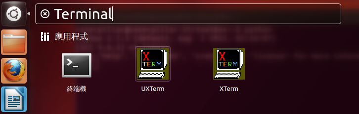

之後，執行以下指令安裝 git：

    $ sudo apt-get install git

安裝完成後，可以使用以下指令下載課程資料：

    $ git clone https://github.com/JustinSDK/PyConTW2013Tutorial.git

在編輯 Python 程式碼時，可以使用任何你慣用的編輯器，為了課程進行時的流暢，本課程環境使用 [Sublime Text 2](http://www.sublimetext.com/2)，這個版本可以免費用於評估，偶而會出現提示訊息詢問是否購買授權，撰寫這篇文章時的 Sublime Text 2 版本是 2.0.2，你可以使用以下指令下載、解壓縮、移動目錄與設定執行檔連結，之後就可以使用 `st2` 指令來開啟 Sublime Text 2：

    $ wget http://c758482.r82.cf2.rackcdn.com/Sublime%20Text%202.0.2.tar.bz2
    $ tar -xf "Sublime Text 2.0.2.tar.bz2"
    $ sudo mv "Sublime Text 2" /usr/lib
    $ sudo ln -s "/usr/lib/Sublime Text 2/sublime_text" /usr/bin/st2

### 練習 0：使用 Python 互動交談環境

這個課程選擇的 Python 實作是 Python 2.7.3，因為這是 Ubuntu 12.04 LTS 內建的 Python 實作，你只要在終端機中鍵入 `python`，就會進入互動式交談環境，先在裏頭輸入 `print 'hello! world!'` 後按 Enter 來個哈囉世界，要離開互動交談環境，可以輸入 `exit()` 後按 Enter 或按 Ctrl + D，這是本課程的第 0 個練習（因為沒什麼困難度 XD）：

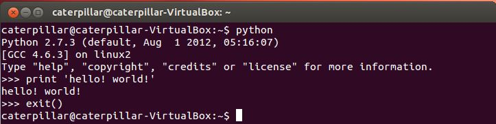

### 練習 1：安裝 Distribute、Pip 與 Virtualenv

在 Python 標準程式庫中有個 `distutils`，是用來建立與安裝額外模組，適用於簡易的安裝場合，有些程式庫擴充了 `distutils`，像是 Distribute，可以使用以下的指令建立、進入 scripts 資料夾，然後下載、安裝 Distribute：

    $ mkdir scripts
    $ cd scripts
    $ wget http://python-distribute.org/distribute_setup.py
    $ sudo python distribute_setup.py

安裝完成後，就有個 `easy_install` 指令可以使用，這個指令有一些問題，因而許多人建議廢棄它不要使用了，課程中會安裝它的替代品 `pip`：

    $ sudo easy_install pip

在安裝 Python 擴充模組時，會需要將某些資料複製至 Python 相關資料夾，也需要一些環境變數等的設定，不同的應用程式可能會需要不同的程式庫版本或相關環境設定，為了方便，可以安裝 virtualenv，它可以讓你很簡易地建立起獨立的 Python 虛擬環境，讓不同的 Python 環境之間彼此互不干擾，這邊使用剛剛安裝好的 `pip` 來安裝 virtualenv：

    $ sudo pip install virtualenv

到這邊為止，課程環境大致準備好了，安裝過程的畫面，可以參考 [我公開投影片](https://www.slideshare.net/JustinSDK/pycon-taiwan-2013-tutorial)，這邊就不再重複抓圖了。那麼，我們安裝了 Distribute、Pip 以及 Virtualenv，這些東西安裝到哪裏去了？如果我們打算在程式碼中引用某個程式庫，那會是什麼搜尋路徑？

Python 的 `sys` 模組（module）中有個 `path` 變數，參考了一個 `list`，當中記錄的 `string`，就是程式庫模組的搜尋路徑。

你可以設定環境變數 `PYTHONPATH`，這個資訊會新增在 Python 的模組搜尋路徑中。例如可在 Ubuntu 中如下設定，並進入 Python 互動交談環境中，使用 `import sys` 匯入 `sys` 模組，可看到 `sys.path` 中新增了 `PYTHONPATH` 設置的路徑：

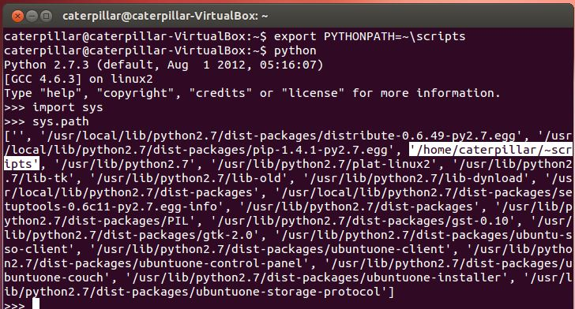

## Distutils、Distribute 與 Pip 間的關係

Distutils 是 Python 內建的標準程式庫，用以建立與安裝額外的模組，適用於簡易的安裝情境，詳細的說明文件，可以參考 Python 官方文件中 [Distributing Python Modules](http://docs.python.org/2/distutils/) 的說明，如果有人使用 `distutils` 建立了可安裝的模組，想安裝該模組的基本步驟就是下載並解壓縮之後，使用 `python` 指令執行其中的 setup.py。例如下載 Django 某版本的 tar.gz 檔後，可以如下進行安裝：

    $ tar xzvf Django-X.Y.Ztar.gz
    $ cd Django-X.Y.Z
    $ sudo python setup.py install

[Setuptools](https://pypi.python.org/pypi/setuptools) 則擴充了 `distutils`，是 Python 社群下載、安裝、昇級與移除套件（Package）事實上的標準（de facto standard），不過近來開發緩慢，程式碼混亂，因而後來有了 [Distribute](https://pypi.python.org/pypi/distribute)，意圖取代 setuptools，Distribute 擴充了 distutils，並提供了對 setuptools 的向後相容（Backward compatibility），先前依賴 setuptools 建立散佈的套件，也可以在 Distribute 中運行如昔。

> 有讀者對課程給予 [回饋](https://www.facebook.com/groups/pythontw/permalink/10152235956363438/)，Distribute 回併至 setuptools 了, 以後只需用 setuptools，詳情可參考 [Distribute Is Now Merged Back To Setuptools](http://omerkatz.com/blog/2013/6/20/distribute-is-now-merged-back-to-setuptools)。

無論是安裝 setuptools 或是 Distribute，都有 `easy_install` 可以使用，不過現在有許多人建議不要使用 `easy_install`，原因是其沒有可以反安裝的選項，只支援 SVN 等 …

Pip 也是用來安裝與管理 Python 模組，它提供了 `easy_install` 的替代品，可以進行套件的反安裝，而且目前專案的維護上還蠻活躍的，基本的安裝與反安裝指令為 `pip install [PACKAGE_NAME]`、`pip uninstall [PACKAGE_NAME]`。

安裝套件時，建議可以使用 `pip`，如果發現有 `pip` 無法安裝的套件，可以嘗試使用 `easy_install`，如果這兩個選項都無法安裝，則可以嘗試尋找是否有 setup.py 進行安裝。

## 使用 Virtualenv

Python 的套件不少都會直接安裝到 Python 預設的一些系統路徑中，像是在上面的圖片中可以看到，Pip 的 pip-1.4.1-py2.7.egg 就安裝到 /usr/local/lib/python2.7/dist-packages 之中，在初學 Python 的練習過程中，也許會安裝許多套件，如果不想都安裝到系統路徑中，或者不具備系統管理者權限而無法安裝到系統路徑，會希望有個虛擬環境可以使用，安裝 Pip 之後，通常會建議安裝 Virtualenv 做為搭配，也就是 〈準備課程環境〉 中最後一個指令 `sudo pip install virtualenv` 的目的。

Virtualenv 可以建立虛擬的 Python 環境，虛擬環境彼此之間互不干擾，也可避免搞亂 Python 主要安裝路徑，可以使用 `virtualenv --distribute venv` 來建立一個虛擬環境路徑，其中 venv 可以是任意的環境名稱，這會建立一個 venv 目錄，進入該目錄後，執行 `source bin/activate` 可以啟動虛擬環境，輸入 `deactivate` 可以關閉虛擬環境。

### 練習 2：哈囉！世界！

這個練習要來使用 Virtualenv 建立並啟用虛擬環境，於其中撰寫一個 Python 程式，可以提示使用者輸入檔名，然後讀取檔案並顯示在終端機中。首先依序輸入以下指令建立、進入並啟用虛擬環境，使用 gedit 編輯 hello.py：

    $ virtualenv --distribute venv
    $ cd venv
    $ source bin/activate
    $ gedit hello.py

嗯？我們不是安裝了 Sublime Text 2 嗎？是沒錯，不過這個 hello.py 中要輸入中文，要讓前一篇文章中安裝的 Sublime Text 2 可以輸入中文，會是另一個故事了（顯示倒是沒問題），所以，這邊還是先使用一下 gedit 來如下編輯 Python 程式碼… XD

```python
# coding=UTF-8
filename = raw_input('檔名：')
 
f = open(filename, 'r')
b_str = f.read()
f.close()
 
print b_str.decode('utf-8') # 這是什麼？
print b_str.decode('utf-8').encode('utf-8') # 這是什麼？
```

編輯完成後存檔，這邊暫不解釋程式碼的細節，附帶一提，練習的程式碼成果，都可以在我的 Github 中的 [PyConTW2013Tutorial](https://github.com/JustinSDK/PyConTW2013Tutorial) 儲存庫中取得。

舉例來說，這個練習的成果，可以在其中的 labs/solutions/exercise2 中取得。接著，使用 gedit 編輯任何一個檔案，寫寫一些文字（中文英文都可以）之後存檔，我這邊存為 hello 檔案，裏頭寫著「哈囉！世界！」。

接著於終端機中執行 python hello.py，你應該可以如下進行操作並看到結果：

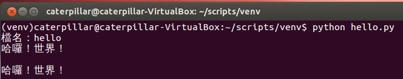

因為我個人不太相信顯示「Hello! World!」的程式碼越短，就代表該程式語言越容易的鬼話，因此你的第一個程式練習不光只是顯示「Hello! World!」，而是讀取檔案與顯示「哈囉！世界！」，第一個程式就可以正確地讀取檔案與顯示中文，是我個人的偏好，因為這涉及到基本的輸入輸出，也涉及到語言處理文字編碼的態度，這會讓入門的第一個程式稍微有挑戰性一點！

接下來的內容，我們要來瞭解一下剛剛的 hello.py 寫了什麼 ...

## Python 的 Unicode 支援

先前的 hello.py 第 1 行是 **編碼宣告（Encoding declaration）**，這是個魔法註解（Magic comment），它告訴 Python 直譯器，這個原始碼檔案是以 UTF-8 來編碼，如果不這麼加上這個魔法註解，Python 2.x 會以 ASCII 編碼來解讀原始碼，那麼就會出現以下錯誤：

> SyntaxError: Non-ASCII character '\xe6' in file hello.py on line 1, but no encoding declared; see http://www.python.org/peps/pep-0263.html for details

魔法註解中設定了 UTF-8，這是因為在 Ubuntu 12.04 LTS 中，預設採用的文字編碼是 UTF-8。

有時我上課會問學員一個問題：「你用的原始碼文字編碼是什麼？」很多學員答不出來，很多人不知道自己作業系統中開個純文字檔編碼是什麼，不知道在整合開發環境（Integrated Development Environment, IDE）中開個原始碼編碼是什麼，當然也就不知道為什麼把 A 專案的原始碼放到 B 專案中程式碼會出現亂碼。

如果你連 UTF-8 是什麼都不知道，那建議你看看我寫的 [亂碼 1/2](http://openhome.cc/Gossip/Encoding/) 中這幾篇文件：
- [哪來的純文字檔？](http://openhome.cc/Gossip/Encoding/TextFile.html)
- [Unicode 與 UTF](http://openhome.cc/Gossip/Encoding/UnicodeUTF.html)
- [UTF-8](http://openhome.cc/Gossip/Encoding/UTF8.html)

**在 Python 2.x，程式中所有文字都是 `str` 的實例，可以視為代表文字資料的位元組序列（Byte sequence）。**例如在 Python 中，可以使用 len 函式來取得序列長度，不過以下的程式會顯示 6，即使 `'測試'` 是兩個字元：

```python
# coding=UTF-8
text = '測試'
print len(text) # 顯示 6
```

這是因為 `'測試'` 這兩個字元，使用 UTF-8 編碼的話，會使用六個位元組，`len` 函式實際上是計算位元組序列的長度，而不是字元長度。

在 Python 2.x 中，如果想要用 Unicode 來代表文字，也就是想要用 `unicode` 型態來封裝文字，可以使用 Unicode 字面常量（Unicode literal） 來表示，也就是在文字前置一個 `u` 符號。例如：

```python
# coding=UTF-8
text = u'測試'
print type(text) # 顯示 "<type 'unicode'>"
print len(text) # 顯示 2
```

直譯器執行程式時，會使用 `unicode` 實例來代表文字資料，這點可以從 `type` 函式得知，它用來探知實例的型態，使用 `len` 取得一個 `unicode` 實例的長度時，它會告訴你有幾個字元。

除了使用 Unicode 字面常量來建立 `unicode` 實例外，在 Python 2.x 中，如果有個 `str` 的實例，可以使用其 `decode` 方法，指定 `str` 的實例代表何種編碼的位元組序列，這樣就可以傳回文字的 `unicode` 實例。相反地，如果使用 `unicode` 實例的 `encode` 方法，可指定編碼取得文字實際編碼後的位元組序列。

**在 Python 3.x 中，預設原始碼檔案必須是 UTF-8 編碼。**如果原始碼檔案想要是 UTF-8 以外的編碼，同樣必須在第 1 行放置編碼宣告。Python 3.x 中，文字是 `str` 型態的實例，不過 **`str` 代表的是 Unicode**（而不是像 Python 2.x 代表的是位元組序列），下面這個程式在 Python 3.x 中執行的話：

```python
text = '測試'
print(type(text)) # 顯示 "<class 'str'>"
print(len(text)) # 顯示 2
```

`len` 表示會有兩個字元。如果想取得文字實際編碼後的位元組序列，可以使用 `encode` 方法指定編碼，這會傳回一個 `bytes` 實例，如果有個 `bytes` 實例，可以使用 `decode` 指定編碼，傳回代表 Unicode 的 `str` 實例。例如下圖是在 Python 3.x 互動交談環境中的測試實例：

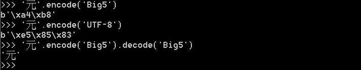

如果想知道更多 Python 中有關文字編碼的細節，可以再參考  [Python 的編碼](http://openhome.cc/Gossip/Encoding/Python.html) 這篇文件。

## 基本 I/O

接下來看看有關基本 I/O 的部份，你可以使用 `open` 函式來開啟檔案，開啟時指定存取模式，`'r'` 表示讀取，`'w'` 表示寫入，`open` 函式會傳回 `file` 實例，使用 `read` 方法可以讀取檔案內容，以 `str` 型態傳回，如先前談到，傳回的 `str` 實際上代表著位元組序列。

以下是個實際的讀取程式範例：

```python
import sys
file = open(sys.argv[1], 'r')
content = file.read()
print content
file.close()
```

程式第一行匯入（import）了 `sys` 模組，`sys.argv` 是個 `list`，其中儲存了執行程式時的命令列引數（Command line arguments），索引 0 固定都是執行時的模組名稱，而後是跟隨著的引數，例如執行 `python hello.py one two three` 時，`sys.argv[0]` 就會是 `'hello.py'`，其餘索引則是 `'one'`、`'two'`、`'three'`。`print` 在 Python 2.x 中是個陳述句，用來顯示指定的資料，不使用檔案時，記得使用 `close` 關閉檔案。

類似地，一個寫入檔案的程式範例如下，`write` 方法會將文字的位元組序列寫入至檔案中：

```python
import sys
file = open(sys.argv[1], 'w')
file.write('test')
file.close()
```

如果要逐行讀取檔案呢？可以使用 `file` 的 `readline` 方法，例如逐行讀取一個文字檔案的所有內容，可以在 `while` 迴圈中進行：

```python
import sys
file = open(sys.argv[1], 'r')
while True:
    line = file.readline()
    if not line: break
    print line
file.close()
```

如果讀不到東西了，那 `readline` 會傳回 `''`，在 `if` 判斷式中，`''` 會被視為 `False`。

`while` 後加上 `:` 表示區塊開始，Python 中使用縮排來決定區塊範圍。注意！你可以自行決定縮排字元，但是 Python 中縮排要一致，如果縮排想使用 Tab 字元，那所有原始碼就都要使用 Tab 字元縮排，如果要使用四個空白字元，那所有原始碼就得是四個空白字元來縮排，強制統一縮排，是 Python 的特色，也是 Python 的文化。

可以使用 `file` 的 `readlines` 方法一次讀取所有檔案內容，這會傳回 `list`，每個索引處代表一行內容，一個程式範例是這樣的：

```python
import sys
file = open(sys.argv[1], 'r')
for line in file.readlines():
    print line
file.close()
```

`for in` 語法可作用在 `list` 上，逐一取出 `list` 中的元素並指定給變數，對於 `for line in file.readlines()` 是這樣閱讀的：對於 `file.readlines()` 傳回的 `list` 中每個元素，將之指定給 `line`。

實際上對於 Python 來說，讀取檔案最好的方式，就是不要去 `read` 它，這是什麼意思？是這樣的…

```python
import sys
for line in open(sys.argv[1], 'r'):
    print line
```

這是 Python 的風格，也是 Python 的文化，這樣的寫法好處就是增加了可讀性，你不用自行使用 `close` 關閉檔案，在 `file` 實例被回收後，檔案就會關閉，`for line in open(sys.argv[1], 'r')` 是這樣閱讀的：對於開啟檔案的每一行。除了可讀性外，這個語法還能讓讀取更有效率，不過現階段你不用管這些事，只要當這語法背後施了些魔法就好。

## 整合開發工具

真正開發程式時，你也許會想要使用整合開發工具，在 Python 的世界中，我確實花了些時間去瞭解有沒有主流的整合開發工具，不過事後覺得，在 Python 的世界中，除了團隊因素決定之外，更多時候是個人口味問題，基於課程時間，我就不逐一討論我調查過的那些工具特色為何了，以下列出一些課程前調查過的幾個：

- [PyCharm / IntelliJ IDEA](http://www.jetbrains.com/pycharm/)
- [PyDev / Eclipse plugin](http://pydev.org/)
- [Komodo IDE](http://www.activestate.com/komodo-ide)
- [Spyder](http://code.google.com/p/spyderlib/)
- [WingIDE](http://wingware.com/)
- [NINJA-IDE](http://www.ninja-ide.org/)
- [Python Tools for Visual Studio](http://pytools.codeplex.com/)

實際上似乎是如此，在 Python 社群中也有討論過 [有沒有好的 Python IDE 呢？](https://www.facebook.com/groups/pythontw/permalink/10152008712448438/)

有沒有好的 Python IDE 呢？
第一堂課的內容就到這邊了，我們認識了 Python 環境的安裝與準備，寫了第一個 Python 程式，瞭解了一些 Unicode 支援，並看了些基本的 I/O，休息一下！後面要來進入第二堂課，瞭解更多 Python 語言的細節。

## 參考資源

- 直譯器的選擇與安裝
  - [Python 3.0 Release](http://www.python.org/download/releases/3.0/)
  - [Python 2.7.3 Release](http://www.python.org/download/releases/2.7.3/)
  - [Picking an Interpreter](http://docs.python-guide.org/en/latest/starting/which-python/)

- 準備課程環境
  - [Installing Python on Linux](http://docs.python-guide.org/en/latest/starting/install/linux/)

- 程式庫在哪呢？
  - [Command line and environment](http://docs.python.org/2/using/cmdline.html)

- Distutils、Distribute 與 Pip 間的關係
  - [distutils](http://docs.python.org/2/library/distutils.html) 
  - [distribute](http://pypi.python.org/pypi/distribute) 
  - [pip](http://pypi.python.org/pypi/pip)
  - [Python 包工具之间的关系](http://blog.yangyubo.com/2012/07/27/python-packaging/) 
  - [Python 套件管理程式簡介](http://www.openfoundry.org/tw/tech-column/8536-introduction-of-python-extension-management-tools)

- 哈囉！世界！
  - [Python Gossip: 基本輸入輸出](http://openhome.cc/Gossip/Python/IOABC.html) 
  - [非關語言：亂碼 1/2](http://openhome.cc/Gossip/Encoding/)
  - [Encoding Gossip: Python 的編碼](http://openhome.cc/Gossip/Encoding/Python.html)

----------
----------

# Python Tutorial 第二堂

第二堂上課囉！在知道怎麼撰寫、執行第一個 Python 程式之後，接下來就要瞭解一下 Python 這個程式語言，只不過我們只剩五個小時，因而採取的方式是，在這一個小時很快地瀏覽過 Python 語言的重要基本元素，之後四個小時再從更多實際的範例中瞭解 Python 語言。

## 內建型態

那麼，哪些東西才是語言中重要而基本的元素呢？Pascal 之父 Niklaus E. Writh 曾說過：

> *Algorithms + Data Structures = Programs*

演算法與資料結構就等於程式，而一門語言提供的資料型態（Data type）、運算子（Operator）、程式碼封裝方式等，會影響演算法與資料結構的實作方式，因此這一堂對於 Python 語言講解的重點將選定在：

- 內建型態（Built-in type）、變數（Variable）與運算子（Operator）
- 函式（Function）、類別（Class）、模組（Module）與套件（Package）

**在 Python 中，萬物皆物件！**不過，物件導向並非 Python 的主要典範（Paradigm），Python 之父 Guido van Rossum 曾言，自己並非物件導向之信徒，在《Masterminds of Programming》書中，Guido van Rossum 說到：

> Python 支援程序式的（Procedural）程式設計以及（某些程度）物件導向。這兩者沒太大不同，然而 Python 的程序式風格仍強烈受到物件影響（因為基礎的資料型態都是物件）。Python 支援小部份函數式（Functional）程式設計 — 不過它不像任何真正的函數式語言。

無論如何，接下來要認識的內建型態都是物件，像是：

- 數值型態（Numeric type）
  - `int`, `long`, `float`, `bool`, `complex`
- 字串型態（String type）
- 容器型態（Container type）
  - `list`, `set`, `dict`, `tuple`

## 數值型態

我們直接進入 Python 互動環境來瞭解這些型態吧！可以使用 `type` 函式來得知值的型態。首先是數值型態：

```
~$ python
Python 2.7.3 (default, Aug  1 2012, 05:16:07) 
[GCC 4.6.3] on linux2
Type "help", "copyright", "credits" or "license" for more information.
>>> type(1)      # 1 是什麼型態？
<type 'int'>
>>> type(1L)     # 加上 L 呢？
<type 'long'>
>>> type(111111111111111111111111111111111) # 太長的整數會自動使用 long 型態
<type 'long'>
>>> type(3.14)   # 浮點數是 float 型態
<type 'float'>
>>> type(True)   # 布林值是 bool 型態
<type 'bool'>
>>> type(3 + 4j) # 支援複數的 complex 型態
<type 'complex'>
>>> 2 ** 100     # 2 的 100 次方
1267650600228229401496703205376L
>>>
```

上面的範例中使用了 `**` 運算子進行次方運算，Python 中當然有加（`+`）、減（`-`）、乘（`*`）等運算子，至於除法則有 / 除法（division）運算子與 `//` 浮點除法（floor division）兩個，在 Python 2.7 中，整數與整數進行 `/` 或 `//` 運算會產生整數；然而整數與浮點數進行 `/` 會保留小數部份，若進行 `//` 則會截去小數部份：

```
>>> 10 / 3
3
>>> 10 // 3
3
>>> 10 / 3.0
3.3333333333333335
>>> 10 // 3.0
3.0
>>>
```

然而 Python 2.x 與 Python 3.x 對於 `/` 的行為不同，例如在 Python 3.3 中，整數與整數進行 `/` 卻是會產生浮點數，原因可看看 [Python Taiwan 社團的討論](https://www.facebook.com/groups/pythontw/10152295869513438/)：

```
>>> 10 / 3
3.3333333333333335
>>> 10 // 3
3
>>> 10 / 3.0
3.3333333333333335
>>> 10 // 3.0
3.0
>>>
```

在浮點數精確度的表現上，也有必須注意的地方。例如：

```
>>> 1.0 - 0.8
0.19999999999999996
>>> print (1.0 - 0.8)
0.2
>>>
```

多數 CPU 與浮點運算器多採用 [IEEE754 浮點數運算（IEEE 754 floating-point arithmetic）](http://zh.wikipedia.org/wiki/IEEE_754)，某些浮點數本身就有誤差，這是每個程式人都應該知道的事。Python 互動環境在顯示值時，採用制式的（Offical）字串表示，而 `print` 語句則採用了非正式的（Informal）字串表示；技術上來說，Python 互動環境會利用物件的 **`_repr__`** 方法傳回的字串來顯示，`print` 語句會利用物件的 **`__str__`** 方法傳回的字串來顯示：

```
>>> repr(1.0 - 0.8)
'0.19999999999999996'
>>> str(1.0 - 0.8)
'0.2'
>>>
```

雖然你也可以用 `(1.0 - 0.8).__repr__()`、`(1.0 - 0.8).__str__()` 來取得字串，不過在 Python 中，**底線開頭暗示著你不要直接呼叫或使用**，因此上面的示範中，使用 `repr` 及 `str` 函式來取得字串。日後你繼續學習 Python 語言的過程中，你會知道，`__repr__` 及 `__str__` 是可以自行定義的。

簡單來說，**用 `__repr__` 來傳回沒有岐義的（Unambigous）字串表示，用 `__str__` 來傳回具可讀性的（Readable）字串表示。**

想要精確地表示浮點數，語言都會提供程式庫，Python 中使用 `decimal` 模組中的 `Decimal` 類別來進行處理。例如：

```
>>> import decimal
>>> a = decimal.Decimal('1.0')
>>> b = decimal.Decimal('0.8')
>>> a - b
Decimal('0.2')
>>> print (a - b)
0.2
>>>
```

## 字串型態

如果要在 Python 中表示字串，可以使用 `''` 或 `""` 包括文字，兩者在 Python 中具相同作用，都可產生 `str` 實例，可視情況互換。例如：

```
>>> "Just'in"
"Just'in"
>>> 'Just"in'
'Just"in'
>>> 'c:\workspace'
'c:\\workspace'
>>> "c:\workspace"
'c:\\workspace'
>>>
```

可以看到，在某些情況下，你不用特別略過（Escape） `\` 字元，然而在底下這種情況下就需要了：

```
>>> 'c:\todo'
'c:\todo'
>>> print 'c:\todo'
c:  odo
>>> print 'c:\\todo'
c:\todo
>>>
```

**可以在字串前加上 `r`，表示接下來後面是原始字串（Raw string）表示**，這樣 Python 就會忠實表示後續的字串，技術上來說，會自動為你處理需要略過的字元。例如：

```
>>> r'c:\todo'
'c:\\todo'
>>> print r'c:\todo'
c:\todo
>>>
```

**Python 中的字串不可變（Immutable）**，你無法改變已建立的字串內容；想得知字串實際的位元組序列長度（不一定是字元長度），可以使用 `len` 函式；可以使用 `for` 來迭代字串；可以使用 `in` 來測試字串是否包括某子字串；可以使用 `+` 來串接字串；可以使用 `*` 來複製字串。例如：

```
>>> name = 'Justin'
>>> len(name)
6
>>> for ch in name:
...     print ch
... 
J
u
s
t
i
n
>>> 'Just' in name
True
>>> name + name
'JustinJustin'
>>> name * 3
'JustinJustinJustin'
>>>
```

可以使用 `[]` 指定索引來取得字串中的某個字元，索引從 0 開始，可以是正數或負數，負數表示從尾端開始計數，例如 -1 就是最後一個字元， -2 就是倒數第二個字元，依此類推。例如：

```
>>> lang = 'Python'
>>> lang[0]
'P'
>>> lang[-1]
'n'
>>>
```

`[]` 也可以用來切割字串，例如：

```
>>> lang[1:5] # 取得索引 1 至 5（包括 1 但不包括 5）的子字串
'ytho'
>>> lang[0:] # 省略結尾索引，表示取至尾端
'Python'
>>> lang[:6] # 省略起始索引，表示從 0 開始
'Python'
>>>
```

`[]` 還可以指定間距（Gap），例如取索引 0 至 6，每 2 個間距的方式取子字串：

```
>>> lang[0:6:2]
'Pto'
>>>
```

`'Python'` 的 `'P'` 至 `'y'` 算一個間距，`'y'` 與 `'t'` 之間也是一個間距，依此類推 `'Python'[0:6:2]` 取得的就是 `'Pto'`，將以上對 `[]` 的運算方式組合在一起，可以得到一個有趣的反轉字串方式 `[::-1]`：

```
>>> lang[::-1]
'nohtyP'
>>>
```

如果要進行字串格式化，以下是舊式寫法：

```
>>> '%d %.2f %s' % (1, 99.3, 'Justin')
'1 99.30 Justin'
>>> '%(real)s is %(nick)s' % {'real' : 'Justin', 'nick' : 'caterpillar'}
'Justin is caterpillar'
>>>
```

技術上來說，字串物件將 `%` 定義為格式化操作，可以接受 `tuple` 與 `dict` 型態，不過這種寫法可讀性不好，從 Python 2.6 之後，建議使用字串的 `format` 方法來取代 `%` 操作：

```
>>> '{0} is {1}'.format('Justin', 'caterpillar')
'Justin is caterpillar'
>>> '{real} is {nick}'.format(real = 'Justin', nick = 'caterpillar')
'Justin is caterpillar'
>>> '{0} is {nick}'.format('Justin', nick = 'caterpillar')
'Justin is caterpillar'
>>> import sys
>>> 'My platform is {pc.platform}'.format(pc = sys)
'My platform is linux2'
>>>
```

到這邊建議你先在 Python 互動環境中，進行上面看到的範例練習。

## 容器型態

想想你平時撰寫的一些應用程式，大部份是在處理一組資料，Python 對管理資料用的容器（Container）型態，在語法上提供直接支援，加上 `for` 包含式（comprehension）的支援，在資料處理問題上可獲得不少的便利性。

Python 支援的容器型態有 `list`、`set`、`dict`、`tuple` 等。

- `list` 型態

`list` 是有序且可變群集（Collection），在 Python 中，`[1, 2, 3]` 這樣的語法，即可建立含元素 1、2、3 而索引 0、1、2 的 `list` 實例。

`list` 與先前介紹過的字串型態享有共同的操作。`len` 傳回 `list` 長度；`in` 可測試某元素是否在 `list` 中；`+` 可以用來串接兩個 `list`；`*` 可用來複製出指定數量的 `list`。`[]` 可以指定索引，用以從 `list` 中取得元素，負索引是從最後一個元素計數，使用 `[]` 來切割 `list` 或許是最有用的功能。其他操作還有…

```
>>> [0] * 10
[0, 0, 0, 0, 0, 0, 0, 0, 0, 0]
>>> ', '.join(['justin', 'caterpillar', 'openhome'])
'justin, caterpillar, openhome'
>>> list('justin')
['j', 'u', 's', 't', 'i', 'n']
>>>
```

- `set` 型態

`set` 型態是無序群集，管理的元素不會重複而且是 [hashable](http://docs.python.org/2/glossary.html#term-hashable)（這中間還有一些要討論的東西，可以參考 [物件相等性（上）](http://www.codedata.com.tw/java/object-equality-1/)）。以下是 `set` 的幾個功能示範：

```
>>> admins = {'Justin', 'caterpillar'}  # 建立 set
>>> users = {'momor', 'hamini', 'Justin'}
>>> 'Justin' in admins  # 是否在站長群？
True
>>> admins & users      # 同時是站長群也是使用者群的？
{'Justin'}
>>> admins | users      # 是站長群或是使用者群的？
{'hamini', 'caterpillar', 'Justin', 'momor'}
>>> admins - users      # 站長群但不使用者群的？
{'caterpillar'}
>>> admins ^ users      # XOR
{'hamini', 'caterpillar', 'momor'}
>>> admins > users      # ∈
False
>>> admins < users 
False 
>>>
```

- `dict` 型態

鍵（Key）值（Value）對應的物件，**鍵物件必須是 hashable**。以下是一些操作示範：

```
>>> passwords = {'Justin' : 123456, 'caterpillar' : 933933}
>>> passwords['Justin']
123456
>>> passwords['Hamimi'] = 970221   # 增加一對鍵值
>>> passwords
{'caterpillar': 933933, 'Hamimi': 970221, 'Justin': 123456}
>>> del passwords['caterpillar']   # 刪除一對鍵值
>>> passwords
{'Hamimi': 970221, 'Justin': 123456}
>>> passwords.items()
[('Hamimi', 970221), ('Justin', 123456)]
>>> passwords.keys()
['Hamimi', 'Justin']
>>> passwords.values()
[970221, 123456]
>>>
```

使用 `[]` 時如果指定的鍵不存在，會發生 `KeyError`，可以使用 `dict` 的 `get` 方法，指定鍵不存在時傳回的預設值。例如：

```
>>> passwords.get('openhome', '000000')
'000000'
>>> passwords['openhome']
Traceback (most recent call last):
  File "", line 1, in 
KeyError: 'openhome'
>>>
```

- `tuple` 型態

`tuple` 型態作用類似 `list`，不過 **`tuple` 實例是不可變（Immutable）**，也就是一旦建立，無法對其增減元素。除了增減元素個數之外，`tuple` 與 `list` 操作上類似，事實上，循序結構的物件（像是字串、`list`、`tuple` 等），在 Python 中共享某些操作方式。管理物件時該使用可變物件還是不可變物件？不可變物件在某些情況下，會擁有較好的效能，之後還會談到更多有關不可變物件的好處。

> 在靜態定型的 Haskell 語言中，Tuple 更具效用，因為 Tuple 中的元素型態就組成了一個新的但未命名的型態。

### 練習 3：Python 互動模式與直譯器指令

開啟一個終端機，鍵入 `python` 指令進入互動模式，接著鍵入以下指令，你會看到什麼？

- `1 + 2`
- `_` 
- `_ + 3`
- `help()` 
- `len`
- `keywords`
- `quit`（或是 `q`）
- `help(len)`
- Ctrl + D

`_` 代表最後一次執行結果，`help()` 會進入文件查詢介面，接著輸入 `len` 會查詢 `len` 函式說明，輸入 `keywords` 會查詢關鍵字有哪些，`quit`（或是 `q`）可以離開文件查詢介面，直接輸入 `help(len)` 也可以直接查詢 `len` 函式說明，Ctrl + D 會離開互動模式，接著直接鍵入以下指令會看到什麼？

- `python -h`
- `python -c 'print "Hello! Python!"'`
- `python -c 'help(len)'`
- `python -c 'import this'`

`-h` 引數會顯示使用說明，`-c` 會直譯後續給定的字串文字，因此 `python -c 'help(len)'` 就是顯示 `len` 函式的說明，**`import this` 會顯示一段文件，代表 Python 的哲學，也是發展的規範**：

```
The Zen of Python, by Tim Peters
 
Beautiful is better than ugly.
Explicit is better than implicit.
Simple is better than complex.
Complex is better than complicated.
Flat is better than nested.
Sparse is better than dense.
Readability counts.
Special cases aren't special enough to break the rules.
Although practicality beats purity.
Errors should never pass silently.
Unless explicitly silenced.
In the face of ambiguity, refuse the temptation to guess.
There should be one-- and preferably only one --obvious way to do it.
Although that way may not be obvious at first unless you're Dutch.
Now is better than never.
Although never is often better than *right* now.
If the implementation is hard to explain, it's a bad idea.
If the implementation is easy to explain, it may be a good idea.
Namespaces are one honking great idea -- let's do more of those!
```

## `if`、`for` 與 `while`

流程語法中最簡單的 `if..else` 分支判斷，在 Python 中是這樣寫的：

```python
from sys import argv
if len(argv) > 1:
    print 'Hello, ' + argv[1]
else:
    print 'Hello, Guest'
```

在 Python 中，使用 `:` 來做為區塊（Block）開始的標示，相同縮排則表示了相同區塊範圍的程式碼，**縮排必須一致**，如果想使用四個空白字元縮排，整個程式都必須是四個空白字元縮排，如果要用 Tab 縮排，整個程式都必須使用 Tab 縮排。Python 中的 `if..else` 也有運算式（Expression）形式，使用上就像是 C 或 Java 的三元運算子 `?:`。`if` 條件式成立的話，會傳回 `if` 左邊的值，否則傳回 `else` 右邊的值。例如上面的程式也可以寫為：

```python
from sys import argv
print 'Hello, ' + (argv[1]) if len(argv) > 1 else 'Guest')
```

Python 中的 `for` 可用來迭代循序結構的物件。例如想將某 `list` 的元素都做二次方運算，收集在另一個 `list` 中的話，可以如下：

```python
numbers = [10, 20, 30]
squares = []
for number in numbers:
    squares.append(number ** 2)
print squares
```

至於 `while`，一般是用在結束條件不確定的情況下。例如求最大公因數可以如下：

```python
print 'Enter two numbers...'
m = int(raw_input('Number 1: '))
n = int(raw_input('Number 2: '))
while n != 0:
   r = m % n
   m = n
   n = r
print 'GCD: {0}'.format(m)
```

回頭看看想這個範例：

```python
numbers = [10, 20, 30]
squares = []
for number in numbers:
    squares.append(number ** 2)
print squares
```

將某 `list` 的元素都做二次方運算，收集在另一個 `list` 中的話，其實還可以使用 `for` 包含式：

```python
numbers = [10, 20, 30]
print [number ** 2 for number in numbers]
```

這樣的寫法顯然簡潔多了。`for` 包含式也可以與條件式結合。例如想收集某個 `list` 中的奇數元素至另一 `list`，單純使用 `for` 迴圈，可以如下：

```python
numbers = [11, 2, 45, 1, 6, 3, 7, 8, 9]
odd_numbers = []
for number in numbers:
    if number % 2 != 0:
        odd_numbers.append(number)
print odd_numbers
```

使用 `for` 包含式的程式碼就簡潔多了：

```python
numbers = [11, 2, 45, 1, 6, 3, 7, 8, 9]
print [number for number in numbers if number % 2 != 0]
```

`for` 包含式（comprehension）也可以形式巢狀結構，例如有個元素都為 `list` 的 `list`，想將其中的 list 元素串起來，也就是將之平坦化，可以如下：

```python
lts = [[1, 2, 3], [4, 5, 6], [7, 8, 9]]
print [ele for lt in lts for ele in lt]
```

當你使用 `[]` 包圍住 `for` 包含式（comprehension） 時，會建立 `list` 實例，如果使用 `{}` 的話，可以建立 `set` 實例，重複的元素會自動去除。例如：

```
>>> {name for name in ['caterpillar', 'Justin', 'caterpillar', 'openhome']}
set(['caterpillar', 'Justin', 'openhome'])
>>>
```

也可以建立 `dict` 實例。例如：

```
>>> {name : passwd for name, passwd in zip(names, passwds)}
{'caterpillar': 123456, 'Justin': 13579, 'openhome': 987654}
>>>
```

上例中的 `zip` 函式，就如名稱意義，會將兩個 `list` 像拉鏈一樣，兩兩相扣在一起為 `tuple`，這些 `tuple` 元素組成一個新的 `list`，對於 `tuple` 元素組成的這個 `list`，每個 tuple 中的一對元素再指定給 name 與 passwd，最後這對 name 與 passwd 組成 dict 的一對鍵值。

> 有些人剛接觸 Python 時，不太習慣 `for` 包含式的寫法，可以來看看 Haskell 中如何表達數學式 `S = { 2 . x | x ∈ N, x ≦ 10}`，Haskell 是寫為 `[2 * x | x <- N, x <= 10]` ，跟原本的數學式很相像，用這個方向來理解 Python 的 `for` 包括式，就比較能夠接受這樣的寫法。

### 練習 4：使用 for 包含式

在 LAB 檔案中，有個 exercises\exercise4\exercise4-1.py，內容如下：

```python
numbers = []
for number in range(20):
    numbers.append(str(number))
print ", ".join(numbers)
```

請試著使用 `for` 包含式來改寫它，解答可在 LAB 檔案的 solutions\exercise4\exercise4-1.py 找到。

> 如果想挑戰比較難的練習，可試著使用 `for` 包含式來求解以下問題：找出周長為 24，每個邊長都為整數且不超過 10 的直角三角形。你可以試著看看 LAB 檔案中 exercises\exercise4\exercise4-2.py 的提示，解答可在 LAB 檔案的 solutions\exercise4\exercise4-2.py 找到。

## 架構程式的思考點

在 Python 中，每個東西都是物件，那麼 Python 是以物件導向作為主要典範嗎？不，Python 之父 Guido van Rossum 曾在《Masterminds of Programming》書中談到：

> *Python supports procedural programming, to some extent, and OO. These two aren’t so different, and Python’s procedural style is still strongly influenced by objects (since the fundamental data types are all objects). Python supports a tiny bit of functional programming—but it doesn’t resemble any real functional language, and it never will.*

基本上，無論採用何種典範，關鍵在於架構程式時應思考的幾個重點，像是…

- **抽象層的封裝與隔離**
- **物件的狀態**
- **名稱空間（Namespace）**
- **資源的實體組織方式，像是原始碼檔案、套件（Package）等**

只有在腦海中清楚地思考過這幾個重點，才能在程式語言中採用適當的機制來加以實現，或者是在程式語言不支援時，想辦法自行實作類似機制，像是在 JavaScript 中，即使沒有名稱空間及套件機制，仍有開發者依各自需求實現各種風格的機制，來解決對應的問題。

幸運地，Python 中對於這幾個思考重點，在實作時提供的機制頗為完整，提供了像是函式（Function）、模組（Module）、類別（Class）與套件等支援。

## 函式

當發現到兩個程式片段極為類似，只有當中幾個計算用到的數值或變數不同時，例如：

```python
...
max1 = a if a > b else b
...
max2 = x if x > y else y
...
```

可以使用函式來封裝程式片段，將流程中引用不同數值或變數的部份設計為參數，例如：

```python
def max(a, b):
    return a if a > b else b
```

**函式是一種抽象，對流程的抽象**，在定義了 `max` 函式之後，客戶端對求最大值的流程，被抽象為 `max(x, y)` 這樣的函式呼叫，求值流程實作被隱藏了起來。

在上面的 Python 程式碼中定義了一個函式，在 Python 中，函式不單只是定義，也是個值，舉例而言，你可以如下將 `max` 指向的函式指定給 `maximum` 變數，透過 `maximum` 來呼叫：

```python
maximum = max
maximum(10, 20) # 傳回 20
```

在 Python 中，可以使用 `lambda` 表示式來定義一個函式，像是 ...

```python
lambda a, b: a if a < b else b
```

這樣的函式稱為 **`λ` 函式**或**是匿名函式（Anonymous function）**，當然，你可以將函式指定給變數：

```python
min = lambda a, b: a if a < b else b
minimum = min
min(10, 20) # 傳回10
minimum(10, 20) # 傳回10
```

## 模組

如果你有一大堆數學相關的函式與常數定義，像是：

```python
def max(a, b):
    return a if a > b else b
def min(a, b):
    return a if a < b else b
 
def sum(*numbers): # numbers 接受可變長度引數
    total = 0
    for number in numbers:
        total += number
    return total
 
pi = 3.141592653589793
e = 2.718281828459045
```

該怎麼組織它們，讓它們有別於其他開發者撰寫的函式與常數定義？避免名稱空間衝突問題？像是其他開發者也在其他地方定義了自己的 `max` 函式？

**在 Python 中，模組是幾個重要抽象層的機制之一，也許是最自然的機制之一**，只要你建立了一個原始碼檔案 modu.py，你就建立了一個模組 `modu`，原始碼主檔名就是模組名稱。

`import modu` 陳述句會在相同目錄下尋找 modu.py，如果沒找到，則會試著尋找在 `sys.path` 中遞迴地尋找 modu.py，如果還是沒有，則會引發 `ImportError` 例外。

**模組提供了名稱空間**。模組中的變數、函式與類別，基本上需透過模組的名稱空間來取得。在 Python 中，**`import`、`import as` 與 `from import` 是陳述句**，可以出現在程式中陳述句可出現的任何位置，它們基本上用來在現有範疇（Scope）中匯入、設定名稱空間，舉例來說，如果先前程式範例是撰寫於 xmath.py 檔案中，那麼以下是一些 `import`、`import as` 與 `from import` 的使用實例，假設這些程式是撰寫在與 xmath.py 相同目錄的另一個 .py 檔案：

```python
import xmath
print '# import xmath'
print xmath.pi
print xmath.max(10, 5)
print xmath.sum(1, 2, 3, 4, 5)
 
print '# import xmath as math'
import xmath as math # 為 xmath 模組取別名為 math
print math.e
 
print '# from xmath import min'
from xmath import min  # 將 min 複製至目前模組，不建議 from modu import *，易造成名稱衝突
print min(10, 5)
```

結果應該會顯示：

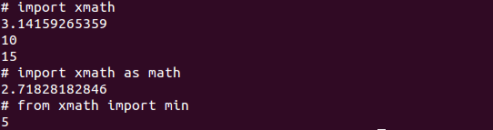

## 類別

對於熟悉物件導向的開發者而言，可能會問：「那類別的應用場合呢？」…嗯…當打算將某些**狀態**與**功能**黏在一起時…例如你可能原本有這樣的一個 bank.py：

```python
def account(name, number, balance):
    return {'name': name, 'number': number, 'balance': balance}
 
def deposit(acct, amount):
    if amount <= 0:
         raise ValueError('amount must be positive')
    acct['balance'] += amount 
 
def withdraw(acct, amount):
    if amount > acct['balance']:
        raise RuntimeError('balance not enough')
    acct['balance'] -= amount
 
def to_str(acct):
    return 'Account:' + str(acct)
```

當中是有關於帳戶建立、存款、提款等函式，你會這麼使用：

```python
import bank
acct = bank.account('Justin', '123-4567', 1000)
bank.deposit(acct, 500)
bank.withdraw(acct, 200)
print bank.to_str(acct)
```

實際上，`bank` 中的函式操作，都是與傳入的 `dict` 實例，也就是代表帳戶狀態的物件高度相關，何不將它們組織在一起呢？這樣比較容易使用些，因此你重新使用類別組織了 bank.py 中的函式：

```python
class Account:
    def __init__(self, name, number, balance):
        self.name = name
        self.number = number
        self.balance = balance
 
    def deposit(self, amount):
        if amount <= 0:
             raise ValueError('amount must be positive')
        self.balance += amount
 
    def withdraw(self, amount):
        if amount > self.balance:
            raise RuntimeError('balance not enough')
        self.balance -= amount
 
    def __str__(self):
        return 'Account({0}, {1}, {2})'.format(
            self.name, self.number, self.balance)
```

在 `Account` 類別中，`__init__` 定義了物件的初始流程，取代了原本的 `account` 函式，注意到每個類別中的函式（或說是方法），**首個參數「必定」接受物件本身，慣例上使用 self 名稱**，相當於其他程式語言中 `this` 的概念，你可以說這是 Python 中 **Explicit is better than implicit** 的哲學，不過其實這還有讓類別動態調有時更為方便的實際意義，這是進階議題，這六個小時的課程中就不談了，有機會看看 Python 的專門書籍，應該都會談到 ...

在類別中還定義了 `__str__`，你應該還記得 〈數值型態〉 中談過 `__str__` 與 `__repr__` 的差別吧？忘記的話，記得回頭複習一下… 在上面的程式中，實際示範了如何在類別中定義 `__str__` 函式。

如此定義之後，客戶端在使用上就容易得多了…

```python
import bank
acct = bank.Account('Justin', '123-4567', 1000)
acct.deposit(500)
acct.withdraw(200)
print acct
```

是的！**容易使用**！在討論物件導向時，大家總是愛談可重用性（Reusability），然而要談到重用性的話，函式的重用性還高上許多，在考量物件導向時，**易用性（Usability）**其實才是它的重點。

## 套件

假設現在你有一些 .py 檔案，別人同樣也有一堆 .py 檔案，你們的檔案現在得放在同一專案中，那麼檔案名稱衝突是有可能發生的，最好是為你們的 .py 檔案分別開設目錄。使用 Python 時，你可以在開設的目錄中放個 **__init__.py** 檔案，這樣 Python 就會將這個目錄視為一個套件，而目錄名稱就是套件名稱。

使用 `import pack.modu` 陳述時，Python 會尋找 pack 目錄，看看裏頭是否有 __init__.py 檔案，然後看看目錄中是否有個 modu.py 檔案。__init__.py 檔案空白也無所謂，實際上當中也可以寫些程式碼，用來執行這個套件中都會需要的初始工作，不過慣例上，除非你有真正不得已的理由，請保持 __init__.py 檔案空白。在找到模組後，實際上會執行其中頂層範疇中的程式碼，之後，模組中的變數、函式、類別等名稱，可以透過 `pack.modu` 來取得。

### 練習 5：運用模組、類別與套件來組織程式

在練習用的檔案中，有個 exercises/exercise5/main.py，裏頭草草寫了一堆函式與變數，以及執行結果輸出的程式碼，請利用這邊介紹的模組、類別與套件，來重新組織當中可重用的程式碼，讓它們可以位於 `pycon` 套件中適當的類別與模組，數學相關的函式，請置於 `xmath` 模組中，而帳戶相關的類別定義，請置於 `bank` 模組中 …

最後，你完成的程式在實體架構上，應該會像是以下的圖片示意（如果不知道怎麼完成實作，記得參考練習用檔案中 solutions/exercise5 的成果 ）：

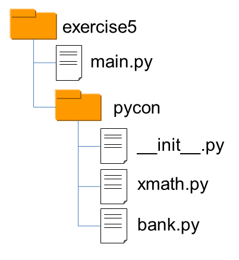

完成這個練習後，第二堂應該時間就差不多到了，休息一下，接下來的第三堂課要來認識 Python 的社群、文件以及更多的 API …

## 參考資源

- 字串型態
  - [`object.__repr__(self)`](http://docs.python.org/2/reference/datamodel.html#object.__repr__) 
  - [`printf`-style String Formatting](http://docs.python.org/py3k/library/stdtypes.html#old-string-formatting)
  - [String Formatting](http://docs.python.org/py3k/library/string.html#string-formatting)

- 清單、集合、字典與元組型態
  - [Python Gossip: 串列](http://openhome.cc/Gossip/Python/ListType.html) 
  - [Python Gossip: 集合](http://openhome.cc/Gossip/Python/SetType.html)
  - [Python Gossip: 字典](http://openhome.cc/Gossip/Python/DictionaryType.html)
  - [Python Gossip: Tuple](http://openhome.cc/Gossip/Python/TupleType.html)

- 函式、模組、類別與套件
  - [Python Gossip: 簡介模組](http://openhome.cc/Gossip/Python/ModuleABC.html)
  - [Python Gossip: 定義類別](http://openhome.cc/Gossip/Python/Class.html)
  - [Structuring Your Project](http://docs.python-guide.org/en/latest/writing/structure/)

- Python 入門的捷徑
  - [Python Shortcuts for the Python Beginner](http://maxburstein.com/blog/python-shortcuts-for-the-python-beginner/)

----------
----------

# Python Tutorial 第三堂

認識一門語言，不能只是學習語言的語法，更要逐步深入瞭解語言背後的社群與文化。

## 社群資源

要瞭解語言的社群與文化，最好的方式就是從認識語言創建者開始，瞭解語言設計的理念，接著從社群網站出發，尋獲更多可以瞭解並參與社群的資源。

- Python 之父

  使用 Python 可別不認識 Python 的創建者 [Guido van Rossum](http://www.python.org/~guido/)（也千萬別寫 [這種信](https://plus.google.com/u/0/115212051037621986145/posts/R8jEVrobbRj) 給他），Guido 是首位享有 **BDFL** 封號的開放原始碼軟體創建者，BDFL 全名為 Benevolent Dictator For Life，中文常翻為「仁慈的獨裁者」，意思是擁有這類稱號的開放原始碼軟體創建者，對社群仍持續關注，在必要時會針對社群中的意見與爭議提出想法與做出最後決定。

  Guido 在 2005 年至 2012 年曾受雇於 Google，大半時間在維護 Python 的開發，2013 年之後離開 Google 進入 Dropbox，除了可以在 [官方個人頁面](http://www.python.org/~guido/) 找到他之外，他也常在 [Google+ 專頁](https://plus.google.com/u/0/115212051037621986145) 發表他的動態。

- Python 軟體基金會

  [Python Software Foundation](http://www.python.org/psf/) 常簡稱為 **PSF**，主要任務為推廣、維護與促進 Python 程式語言的發展，同時也支持協助全球各地各式各樣 Python 程式設計師與社群的成長。PSF 是符合美國國內稅收法（Internal Revenue Code, IRC）中 [501(c)](http://en.wikipedia.org/wiki/501(c)_organization) 條款的非營利組織，持有 Python 程式語言背後的智慧財產權。

- Python 改進提案

  [Python Enhancement Proposals](http://www.python.org/dev/peps/) 常簡稱為 **PEPs**，Python 的改進大多是由 PEP 流程主導，PEP 流程會收集來自社群的意見，為將來打算加入 Python 的新特性提出文件提案，重要的 PEP 會經由社群與 Guido 審閱與評估，決定是否成為正式的 PEP 文件。

  因此 PEP 文件本身說明了它對 Python 的改變，以及實作特性時應遵守的標準，**在剛開始認識 Python 時，有幾個重要的 PEP 是必須認識的**：

  - [PEP 1](http://www.python.org/dev/peps/pep-0001/) – PEP 的作用與執行準則，說明了何為 PEP、PEP 的類型、提案方式等。
  - [PEP 8](http://www.python.org/dev/peps/pep-0008/) – Python 的程式碼風格，包括了程式碼的編排、命名、註解等風格指引。
  - [PEP 20](http://www.python.org/dev/peps/pep-0020/) – Python 禪學（The Zen of Python），也就是 〈練習3〉 執行 `import this` 時，可以看到的話語。
  - [PEP 257](http://www.python.org/dev/peps/pep-0257/) – 撰寫 Docstrings 時的慣例，Docstring 是可內建於 Python 程式中的說明文件字串，稍後就會說明。

- Python Conference

  全世界各地都有 Python 使用者，這些使用者會在各地舉辦各式大大小小的研討會，如果想要知道各地的研討會資訊，可以從 [PyCon](http://www.pycon.org/) 這個網站開始，它列出了全球各地 Python 研討會的網址、活動日期等資訊。

  在這個網站上，你可以找到 [“PyCon Taiwan" in Taiwan](https://tw.pycon.org/)，連結至網站之後，你可以看到台灣 Python 社群關心的重要研討會訊息。

- Python 使用者群

  除了研討會之外，Python 使用者會舉辦週期性的聚會，你可以在 [LocalUserGroups](https://wiki.python.org/moin/LocalUserGroups) 上找到全球各地的 Python 使用者聚會資訊，以台灣來說，撰寫文章的此時擁有的週期性聚會資訊有：

  - [PyTUG Wiki](http://wiki.python.org.tw/) – 台灣 Python 使用者群 Wiki 網站
  - [PyTUG Groups](http://groups.google.com/group/pythontw) – 台灣 Python 使用者群論譠
  - [PyHUG Meetups](http://www.meetup.com/pythonhug/) – 新竹 Python 使用者群
  - [Taipei.py Meetups](http://www.meetup.com/Taipei-py/) – 台北 Python 使用者群
  - [Tainan.py Meetups](http://www.meetup.com/Tainan-py-Python-Tainan-User-Group/) – 台南 Python 使用者群

## 文件資源

Python 的官方網站是 [www.python.org](http://www.python.org)，不少文件資源等，都可以在官方網站上尋得。

對於 API 的使用，實際上，Python 的 API 本身就附有文件，舉 `len` 函式來說，如果你在互動模式中鍵入 `len.__doc__` 會發生什麼事呢？

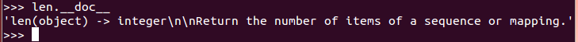

這字串很奇怪？如果鍵入 `help(len)` 就不會覺得奇怪了：

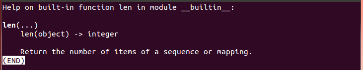

實際上，`help` 函式會取得 `len.__doc__` 的字串結果並顯示出來，就類似於你執行 `print(len.__doc__)` 的結果：

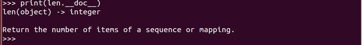

透過 `len.__doc__` 取得的字串稱為 **DocStrings**，你可以為 API 定義自帶的文件資訊。例如，試著在互動模式中鍵入以下程式碼：

```python
def max(a, b):
    '''max(a, b) -> value
 
       With two arguments, return the largest argument.'''
    return a if a > b else b
```

`'''` 包括的字串是可以換行的，如果這樣的字串出現在函式的開頭，那它會成為函式物件的 `__doc__` 屬性值，因此接下來，如果你鍵入 `max.__doc__` 或 `help(max)`，將會看到以下畫面：

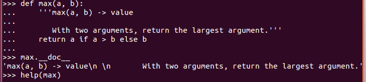

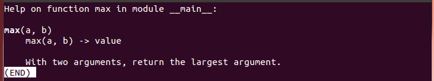

先前談到，[PEP 257](http://www.python.org/dev/peps/pep-0257/) 中說明了撰寫 Docstrings 時的慣例，你可以在當中取得更多撰寫 Docstrings 的資訊。

談到文件，Python 官方網站的文件是列於 [docs.python.org](http://docs.python.org/)，連上後目前預設會顯示 Python 3 的文件，你可以於網站左上角選擇想要閱覧的 Python 版本：

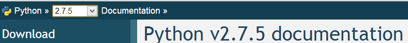

在完成本課程後，建議可以繼續閱讀網站上的 [Tutorial](http://docs.python.org/2.7/tutorial/index.html)，當然，先前 〈Distutils、Distribute 與 Pip 間的關係〉 中談到的 `distutils`，在網站上也有 [Distributing Python Modules](http://docs.python.org/2.7/distutils/index.html) 文件可以進一步閱讀。如果想查詢 API 文件，則可以從 [The Python Standard Library](http://docs.python.org/2.7/library/index.html) 開始。

除了連上網站查詢 API 文件之外，由於 Python 的標準 API 都有撰寫 Docstrings，你還可以使用 `pydoc` 指令來讓你閱讀 Docstrings 時更為便利，例如，執行 `pydoc -p 9999` 之後，會啟動一個簡單的 pydoc 伺服器，接下來可利用瀏覽器連結本機 localhost:9999 查看文件：

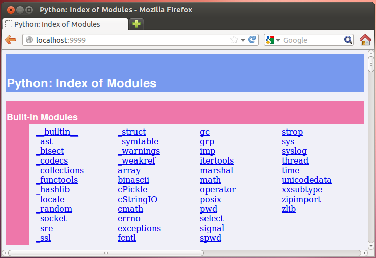

如果你跟我一樣，是個熟悉 Java 的使用者，也許會比較習慣 JavaDoc 的風格，那麼可以試著使用 [EpyDoc](http://epydoc.sourceforge.net/)，它文件的風格很類似 JavaDoc，例如，[線上版本的 EpyDoc](http://epydoc.sourceforge.net/api/) 風格如下：

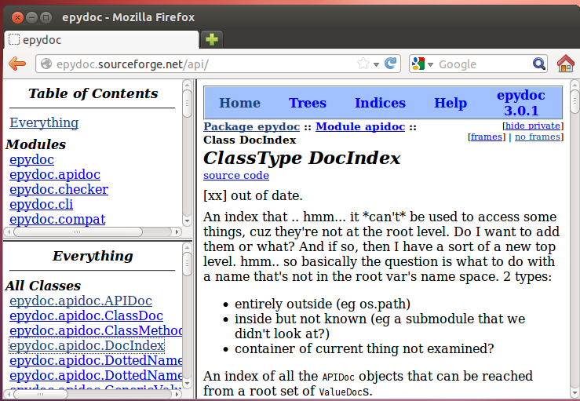

瞭解了 Python 的文件資源之後，接下來要來介紹更多實用的 API 了，下個主題會是一些資料處理的相關函式介紹。

## 資料處理函式

在 Python 的 `__builtin__` 模組中有一些函式，不需要 `import` 也可以使用，有幾個簡單好用的資料處理函式值得介紹：

- `range(start, stop[, step])`
- `zip([iterable, ...])`
- `enumerate(sequence, start=0)`
- `reduce(function, iterable[, initializer])`

### 練習 6：使用 `range`、`zip` 與 `enumerate`

在 Python 中，如果想使用 `for in` 語法來迭代 `list`，而且希望取得索引資訊，該如何進行呢？例如，如果有個 `list = ['Justin', 'caterpillar', 'openhome']`，想要有以下的顯示結果：

    0, Justin
    1, caterpillar
    2, openhome

先給個小提示，程式基本上可以長這樣：

```python
names = ['Justin', 'caterpillar', 'openhome']
for ______ in ______:
    print '{0}, {1}'.format(______)

```

試著想想，如果使用分別使用 `range`、`zip` 與 `enumerate`，那麼程式中三個空白處怎麼寫呢？別忘了，查看一下 `range`、`zip` 與 `enumerate` 的文件，他們都在 [`__builtin__`](http://docs.python.org/2/library/functions.html) 模組的文件中。

別忘了，你可以在 Lab 檔案的 solutions 目錄找到解答。

- `reduce`

`__builtin__` 中的 `reduce`，有時在別的語言中會被稱為 foldLeft，**它其實代表了一種高度抽象化後的流程重用**，只要是打算從清單中求值的需求，基本上都可以使用它。

舉例來說，如果你想要知道 `[1, 2, 3, 4, 5]` 的加總，雖然可以直接撰寫迴圈來求值，不過，也可以撰寫為 `reduce(lambda sum, elem: sum + elem, [1, 2, 3, 4, 5], 0)` 來求值，試試在 Python 互動環境中鍵入，結果會是 15。

初學者會有點難懂 `reduce` 的原理，可以想想，如果 `reduce` 接受的 `lambda` 部份，改為一個具體名稱的 `add` 函式，那麼就可以寫為 為 `reduce(add, [1, 2, 3, 4, 5], 0)` ，那 `reduce` 的運作就像是折紙，從 0 開始，每折一次就與 `list` 中的元素進行一次 `add`，折完後的結果就是加總值。

這個 `reduce` 函式很有用，可以有一百萬種用法，只要你想從某個清單中求值，都可以使用 `reduce`，只要你依需求給 `reduce` 要處理的函式與初值。

### 練習 7：使用 `reduce`

使用 `reduce` 與 `for` 包含式，將以下的範例進行重構，目標是清除所有顯式的迴圈流程：

```python
def ascending(a, b): return a - b
def descending(a, b): return -ascending(a, b)
# selection sort
def sorted(xs, compare = ascending):
    return [] if not xs else __select(xs, compare)
 
def __select(xs, compare):
    selected = xs[0]
    for elem in xs[1:]:
        if compare(elem, selected) < 0:
            selected = elem
 
    remain = []
    selected_list = []
    for elem in xs:
        if elem != selected:
            remain.append(elem)
        else:
            selected_list.append(elem)
 
    return xs if not remain else selected_list + __select(remain, compare)
 
print sorted([2, 1, 3, 6, 5])
print sorted([2, 1, 3, 6, 5], descending)
```

> **關於函數式程式設計** 想要知道 `reduce` 的原理，可以看看 [List 處理模式](http://www.codedata.com.tw/java/functional-programming-for-java-developers-3-list-patterns/) 中的說明。 實際上，`reduce` 與 `for` 包含式的概念源自函數式程式設計（Functional programming），嗯？好像很高深，其實如果你能完成練習 7，你已經做了一次函數式程式設計了。
> 
> 不過，何時該使用函數式的元素，取決於可讀與風格問題，在 Python 中確實是有那麼一些函數式程式設計的元素，`for` 包含式在 Python 中應用的很多，因為可以增加可讀性，然而像 `reduce` 這種元素，由於可讀性並不好，因而並不太鼓勵去用它，用更具體的函式名稱來封裝 reduce 會更好，以上面的加總來說，可以寫個 `sum` 函式來表達意圖。實際上，在 Python 3 中，`reduce` 不再位於 `__builtin__` 模組，而被移至 `funtools` 模組了。
> 
無論如何，藉由這個練習，瞭解到 Python 可進行多重典範設計，只要你願意的話，函數式是可以的設計之一；接下來的內容，是要介紹 Python 中對永續化（Persistence）的基本支援，順便來看看幾種永續設計方式。

## 永續化機制

在 〈基本 I/O〉 中談過基本輸入輸出，除了利用基本 I/O 來保存運算結果之外，Python 中還提供了一些方式，可以直接保存物件狀態，在下次重新執行程式時讀取以恢復運算時必要的資料，在這邊要介紹幾個方式，像是 …

- 物件序列化（Serialization）
  - 如透過  `marshal`、`pickle`、`cPickle` 模組
- DBM（Database Manager）
  - 簡單的 “資料庫" 介面。DBM 物件行為上像個字典（Dictionary）物件，不過鍵（Key）值（Value）型態都必須是字串。
- `shelve` 模組
  - 一個 `shelve` 物件是個像字典的永續物件，不過值可以是 `pickle` 模組可處理的 Python 物件。
- DB-API 2.0（PEP 249）
  - 存取資料庫的標準介面。

除此之外，你還可以透過第三方程式庫，進行物件關聯對應（Object-Relational Mapping），像是 [SQLAlchemy](http://www.sqlalchemy.org/)、[SQLObject](http://www.sqlobject.org/)，由於時間的關係，ORM 沒辦法在這節課做說明，不過稍後介紹 Django 時，會看到一些 ORM 的實際例子。

## `marshal`、`pickle` 與 `cPickle`

在物件序列化方面，`marshal` 是個很基礎的模組，其存在主要是為了支援 Python 的 .pyc 檔案。

一般來說，如果要序列化 Python 物件，使用 `pickle` 模組會是比較好的方式，`pickle` 會記錄已經序列化的物件，如果後續有物件參考到相同物件，才不會再度被序列化。`pickle` 可以序列化使用者自定義的類別及實例，在格式方面，`pickle` 格證向後相容於新的 Python 版本。

`cPickle` 模組則是用 C 實作的模組，介面上與 `pickle` 相同，速度在理想上可達 `pickle` 的 1000 倍。

來看看使用 `pickle` 的一些程式範例，這個範例也示範了實作永續機制時的一種模式，用來序列化 `DVD` 物件的狀態：

```python
class DVD:
    def __init__(self, title, year=None,
        duration=None, director_id=None):
        self.title = title
        self.year = year
        self.duration = duration
        self.director_id = director_id
        self.filename = self.title.replace(' ', '_') + '.pkl'
 
    def check_filename(self, filename):
        if filename is not None:
            self.filename = filename
```

這個 `DVD` 物件有 `title`、`year`、`duration`、`director_id` 四個狀態，每個 `DVD` 物件會以 `title` 作主檔名，加上 .pkl 副檔名進行儲存。接下來列出儲存物件的 `save` 方法：

```python
def save(self, filename=None):
    self.check_filename(filename)
    fh = None
    try:
        data = (self.title, self.year, 
                self.duration, self.director_id)
        fh = open(self.filename, 'wb')
        pickle.dump(data, fh)
    except (EnvironmentError, pickle.PicklingError) as err:
        raise SaveError(str(err))
    finally:
        if fh is not None:
            fh.close()
```

最主要地，你要以 `'wb'` 模式開啟檔案，然後使用 pickle.dump 進行物件序列化。接下來列出載入檔案 `load` 方法定義：

```python
def load(self, filename=None):
    self.check_filename(filename)
    fh = None
    try:
        fh = open(self.filename, 'rb')
        data = pickle.load(fh)
        (self.title, self.year, 
         self.duration, self.director_id) = data
    except (EnvironmentError, pickle.PicklingError) as err:
        raise LoadError(str(err))
    finally:
        ...
```

這次是讀取，因此你要用 `'rb'` 模式開啟檔案，然後使用 `pickle.load` 載入檔案。這個 `DVD` 物件可以這麼使用：

```python
filename = 'PyConTutorial2013.pkl'
dvd1 = DVD('PyCon Tutorial', 2013, 1, 'Justin Lin')
dvd1.save()
 
dvd2 = DVD('PyCon Tutorial')
dvd2.load()
print dvd2
```

## DBM

`dbm` 為柏克萊大學發展的檔案型資料庫，Python 的 `dbm` 模組提供了對 Unix 程式庫的介面。`dbm` 物件就像個字典，在不需要關聯式資料庫，只需要快速存取鍵值的場合可以使用，`dbm` 物件的鍵值都必須是字串。Python 提供 DBM 的多數實現，如果你不確定要用哪一種，可以使用 `anydbm` 模組，它會檢查並選擇系統上可用的 DBM 實作。

在這邊直接轉貼 [`anydbm — Generic access to DBM-style databases](http://docs.python.org/2.7/library/anydbm.html) 中的範例程式碼作個示範：

```python
import anydbm
 
# Open database, creating it if necessary.
db = anydbm.open('cache', 'c')
 
# Record some values
db['www.python.org'] = 'Python Website'
db['www.cnn.com'] = 'Cable News Network'
 
# Loop through contents. Other dictionary methods
# such as .keys(), .values() also work.
for k, v in db.iteritems():
    print k, '\t', v
 
# Storing a non-string key or value will raise an exception (most
# likely a TypeError).
db['www.yahoo.com'] = 4
 
# Close when done.
db.close()
```

## `shelve` 模組

`shelve` 物件也是個行為上像是字典的物件，與 DBM 差別在於值的部份可以是 `pickle` 模組可處理的 Python 物件。以下來看個實例，搭配 [DAO 模式](http://en.wikipedia.org/wiki/Data_access_object) 來使用 `shelve` 模組的功能：

```python
class DvdDao:
    def __init__(self, shelve_name):
        self.shelve_name = shelve_name
 
    def save(self, dvd):
        shelve_db = None
        try:
            shelve_db = shelve.open(self.shelve_name)
            shelve_db[dvd.title] = (dvd.year,
                dvd.duration, dvd.director_id)
            shelve_db.sync()
        finally:
            if shelve_db is not None:
                shelve_db.close()
```

`save` 方法中，主要是使用 `shelve.open` 來開啟永續化時的字典檔案，在指定鍵值之後，使用 `sync` 方法將資料從快取中寫回檔案。接下來列出的 DAO 方法實作也是類似的操作：

```python
def all(self):
    shelve_db = None
    try:
        shelve_db = shelve.open(self.shelve_name)
        return [DVD(title, *shelve_db[title]) 
                for title in sorted(shelve_db, key=str.lower)]
    finally:
        if shelve_db is not None:
            shelve_db.close()
    return []
 
def load(self, title):
    shelve_db = None
    try:
        shelve_db = shelve.open(self.shelve_name)
        if title in shelve_db:
            return DVD(title, *shelve_db[title])
    finally:
        if shelve_db is not None:
            shelve_db.close()
    return None
 
def remove(self, title):
    shelve_db = None
    try:
        shelve_db = shelve.open(self.shelve_name)
        del shelve_db[title]
        shelve_db.sync()
    finally:
        if shelve_db is not None:
            shelve_db.close()
```

以下是個使用 `DvdDao` 的例子：

```python
filename = 'dvd_library.slv'
dao = DvdDao(filename)
dvd1 = DVD('PyCon Tutorial 2012', 2012, 1, 'Justin Lin')
dvd2 = DVD('PyCon Tutorial 2013', 2013, 1, 'Justin Lin')
dao.save(dvd1)
dao.save(dvd2)
print dao.all()
print dao.load('PyCon Tutorial 2012')
dao.remove('PyCon Tutorial 2013')
print dao.all()
```

## DB-API 2.0（PEP 249）

為 Python 中存取資料庫的標準介面，就我的認知而言，其角色應該是類似於 Java 中的 JDBC。Python 中的 `sqlite3` 模組，提供了 DB-API 2.0 的實作，可用以存取 SQLite 資料庫。接下來的範例，會存取的資料庫表格如下：

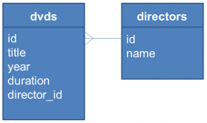

以下直接列出範例程式碼，程式很簡單，應該一目瞭然，API 細節可參考 [sqlite3 — DB-API 2.0 interface for SQLite databases](http://docs.python.org/2.7/library/sqlite3.html)。

```python
def connect(name):
    create = not os.path.exists(name)
    conn = sqlite3.connect(name)
    if create:
        cursor = conn.cursor()
        cursor.execute("CREATE TABLE directors ("
            "id INTEGER PRIMARY KEY AUTOINCREMENT UNIQUE NOT NULL, "
            "name TEXT UNIQUE NOT NULL)")
        cursor.execute("CREATE TABLE dvds ("
            "id INTEGER PRIMARY KEY AUTOINCREMENT UNIQUE NOT NULL, "
            "title TEXT NOT NULL, "
            "year INTEGER NOT NULL, "
            "duration INTEGER NOT NULL, "
            "director_id INTEGER NOT NULL, "
            "FOREIGN KEY (director_id) REFERENCES directors)")
        conn.commit()
 
    return conn
 
def add_dvd(conn, title, year, duration, director):
    director_id = get_and_set_director(conn, director)
    cursor = conn.cursor()
    cursor.execute("INSERT INTO dvds "
                   "(title, year, duration, director_id) "
                   "VALUES (?, ?, ?, ?)",
                   (title, year, duration, director_id))
    conn.commit()
 
def get_and_set_director(conn, director):
    director_id = get_director_id(conn, director)
    if director_id is not None:
        return director_id
    cursor = conn.cursor()
    cursor.execute("INSERT INTO directors (name) VALUES (?)",
                   (director,))
    conn.commit()
    return get_director_id(conn, director)
 
def get_director_id(conn, director):
    cursor = conn.cursor()
    cursor.execute("SELECT id FROM directors WHERE name=?",
                   (director,))
    fields = cursor.fetchone()
    return fields[0] if fields is not None else None
 
def all_dvds(conn):
    cursor = conn.cursor()
    sql = ("SELECT dvds.title, dvds.year, dvds.duration, "
           "directors.name FROM dvds, directors "
           "WHERE dvds.director_id = directors.id"
           " ORDER BY dvds.title")
    cursor.execute(sql)
    return [(str(fields[0]), fields[1], fields[2], str(fields[3]))
            for fields in cursor]
 
def all_directors(conn):
    cursor = conn.cursor()
    cursor.execute("SELECT name FROM directors ORDER BY name")
    return [str(fields[0]) for fields in cursor]
```

以下是個存取資料庫的例子：

```python
db_name = 'dvd_library.sqlite3'
conn = connect(db_name)
add_dvd(conn, 'Python Tutorial 2013', 2013, 1, 'Justin')
print all_directors(conn)
print all_dvds(conn)
```

### 練習 8：永續化機制

在 Lab 檔案中有個 lab/exercises/exercise8，當中有 pickle、shelve、sql 三個資料夾，分別是上頭三個程式範例，不過程式碼內容不完整，請任選你想要練習的對象，按加上頭列出的範例程式碼，就不齊全的部份補齊。

完成這個練習後，第三堂應該時間就差不多到了，休息一下，接下來的第四堂課要來認識 Python 的 Web 框架 …

## 參考資源

- The Community
  - [Guido van Rossum - Personal Home Page](http://www.python.org/~guido/)
  - [Python Software Foundation](http://www.python.org/psf/)
  - [PEP Index](http://www.python.org/dev/peps/)
  - [PyCon](http://www.pycon.org/)
  - [LocalUserGroups](http://wiki.python.org/moin/LocalUserGroups/)

- 文件
  - [Python v2.7.6 documentation](http://docs.python.org/2.7/)
  - [pydoc — Documentation generator and online help system](http://docs.python.org/2/library/pydoc.html)

- 資料處理函式
  - [Built-in Functions](http://docs.python.org/2.7/library/functions.html)

- 永續化
  - [pickle — Python object serialization](http://docs.python.org/2/library/pickle.html)
  - [dbm — Simple “database” interface](http://docs.python.org/2.7/library/dbm.html)
  - [shelve — Python object persistence](http://docs.python.org/2/library/shelve.html)
  - [sqlite3 — DB-API 2.0 interface for SQLite databases](http://docs.python.org/2.7/library/sqlite3.html)

----------
----------

# Python Tutorial 第四堂

這堂課開始，我們要來看看如何使用 Python 來撰寫 Web 應用程式，使用的框架（Framework）是 [Django](https://www.djangoproject.com/)。**那麼什麼是框架？它跟程式庫（Library）有何不同？**

## 程式庫 vs 框架

從課程一開始，你就一直在使用程式庫，你的程式流程一直在你的控制之內，**你決定了**程式何時要使用程式庫來詢問使用者問題、何時要讀取使用者回應、何時要處理結果 … 就像是以下的程式中，你決定在流程中使用程式庫中的 `raw_input` 函式、自定義的 `process_name` 函式以及 `process_quest` 函式等 …

```python
name = raw_input('What is your name?')
process_name(name)
quest = raw_input('What is your quest?')
process_quest(quest)
```

當你開始使用框架，你會發現不是你決定程式流程，你會定義函式，**由框架決定**何時來呼叫你定義的函式。**流程的控制權被反轉了，現在是框架在定義流程，在既定的流程中框架會呼叫你的函式，而不是你來呼叫框架**。例如，你會使用 GUI 框架 Tkinter 來組合這樣的視窗 …

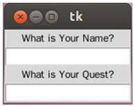

你需要依框架的要求進行畫面組合，並安排好等待被呼叫的一些自定義函式，像是 `process_name` 之類的 … 例如 …

```python
import Tkinter
 
top = Tkinter.Tk()
 
Tkinter.Label(top, text='What is Your Name?').pack()
name_var = Tkinter.StringVar()
name_entry = Tkinter.Entry(top, textvariable=name_var)
name_entry.pack()
name_entry.bind('', lambda event: process_name(name_var))
 
Tkinter.Label(top, text='What is Your Quest?').pack()
quest_var = Tkinter.StringVar()
quest_entry = Tkinter.Entry(top, textvariable=quest_var)
quest_entry.pack()
quest_entry.bind('', lambda event: process_name(quest_var))
 
Tkinter.mainloop()
```

當使用者作出動作，框架會有既定的處理流程，並在對應的時機點呼叫你定義的函式。

- IoC（Inversion of Control）

在談到框架時，經常會聽到 **IoC** 這個縮寫名稱，也就是 **Inversion of Control**，既控制權反轉，什麼控制權被反轉了？誰能決定程式的流程！

使用程式庫的話，流程的控制是這樣的 …

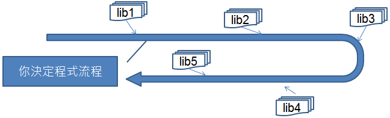

藍色部份是你可以自行掌控的部份，你決定程式流程走向，並在過程中必要時機，引用各種程式庫！

使用框架的話，流程的控制是這樣的 …

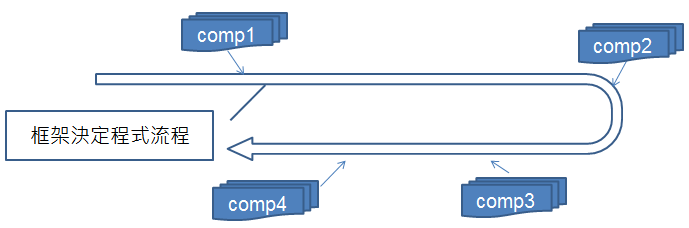

藍色部份是你可以自行掌控的部份，也就是框架規範下可進行的元件實作，框架在本身定義的流程下適當時機，會呼叫你的元件實作。

- 我們需要使用框架嗎？

應用程式開發時是否需要使用框架，有很多考量點 … 然而簡單來說 … **使用程式庫時，開發者會擁有較高的自由度；使用框架時，開發者會受到較大的限制**。

限制？有哪些限制？很多 … 是否需要使用框架？是否要遵循框架規範的流程？使用框架是基於技術考量？還是基於商業上的考量？（嗯 … 因為這框架是採購案中被綁在一起的 … 上頭叫我們要用我們就得用？）… 這幾個問題都是必須想想看的 …

股市有句名言，好的老師帶你上天堂，不好的老師帶你住套房。用框架時可以這麼想 … **好的框架帶你上天堂，不好的框架讓你住套房** … XD

## Django 起步走

這堂課會使用 Django 這個框架來進行 Web 應用程式的練習，在 Python 的世界中，如果你願意遵守且認同 Django 定義的流程、語義等，那你就會覺得這是個高階、快速開發、簡潔的 Web 框架。在官方網站上列出了一些特性：

- 物件關聯（Object-relational）模型對應
- 內建管理介面
- 優雅的 URL 設計
- 頁面樣版系統
- 快取系統
- 國際化（Internationalization）

來看一下官方網站上幾個範例片段 … 像是永續化時的模型（Model）設計 …

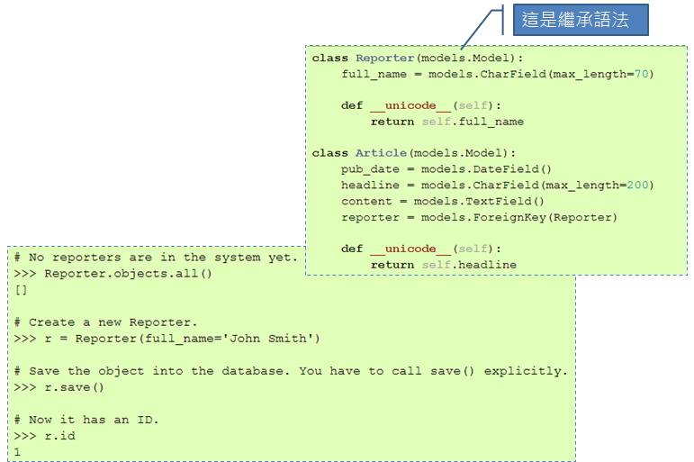

這是 URL 設計時的方式，使用正則表示式來設計 URL …

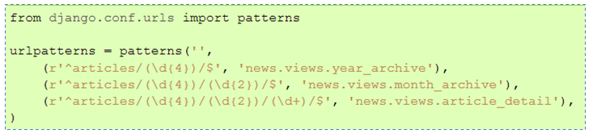

畫面（View）設計與樣版系統 …

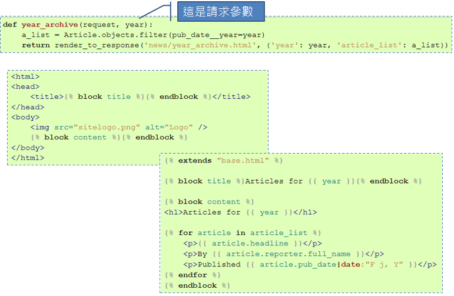

以下透過練習直接來準備一下 Django 專案 …

### 練習 9：建立 Django 專案

在實際進行這門課程時，使用的 Django 版本是 1.5.1，因而這邊仍固定使用這個版本來示範 … 這邊會建立一個虛擬環境，並透過 `pip` 來安裝 Django，指令如下：

```
~/scripts$ virtualenv --distribute venv
~/scripts$ cd venv
~/scripts/venv$ source bin/activate
~/scripts/venv$ pip install Django==1.5.1
~/scripts/venv$ python -c 'import django; print django.get_version()'
~/scripts/venv$ django-admin.py startproject mysite
~/scripts/venv$ ls -al mysite
~/scripts/venv$ cd mysite
~/scripts/venv$ python manage.py runserver
```

指令中透過 `django-admin.py startproject mysite` 建立了一個 Django 專案為 mysite，完成 `python manage.py runserver` 指令後，你應該會看到 Django 開發時的簡單伺服器啟動了 …

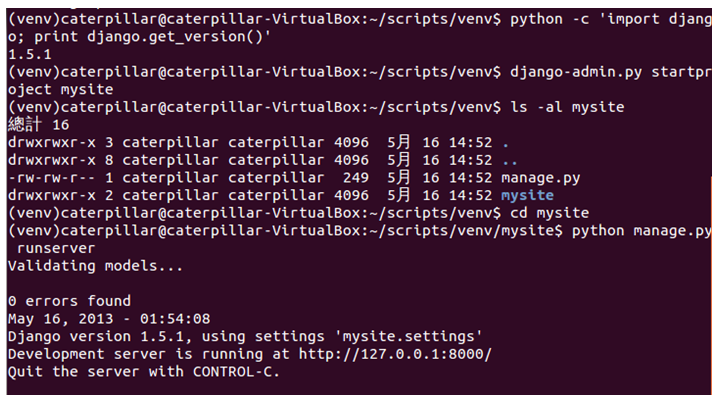

開啟你的瀏覽器，瀏覽 http://127.0.0.1:8000/，你應該要看到以下畫面 …

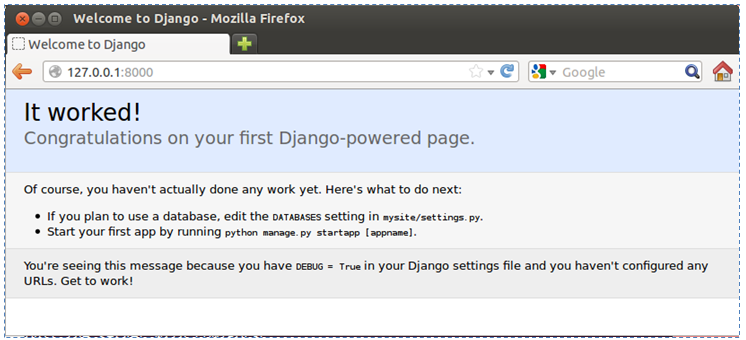

這個專案中還有什麼呢？後面我們還會繼續探討 …

## 建立 App 與基本 ORM

你已經建立第一個 Django 專案，那麼專案中有哪些東西呢？我們來看看 …

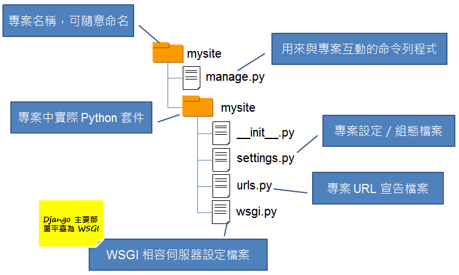

相關的組態設定該如何進行，我們還是實際從練習中瞭解 …

### 練習 10：建立資料庫與 App

開啟 mysite/settings.py，將其中 `DATABASES` 的 `'default'` 項目中，`'ENGINE'` 設定為 `'django.db.backends.sqlite3'`，`'NAME'` 設定為你想要的資料庫檔案位置，例如 `'/home/caterpillar/scripts/venv/mysite/db.sqlite3'`：

```python
...
DATABASES = {
    'default': {
        'ENGINE': 'django.db.backends.sqlite3', 
        'NAME': '/home/caterpillar/scripts/venv/mysite/db.sqlite3',                      
        'USER': '',
        'PASSWORD': '',
        'HOST': '',                     
        'PORT': '',                    
    }
}
...
```

接著執行 `python manage.py syncdb`，你就會看到一些建構資料表格的過程，然後會建立一個預設的驗證系統，如果你想要使用 Django 預設的後台管理，就會使用到這個驗證系統，你可以輸入使用者名稱、郵件、密碼等，下圖是個示範：

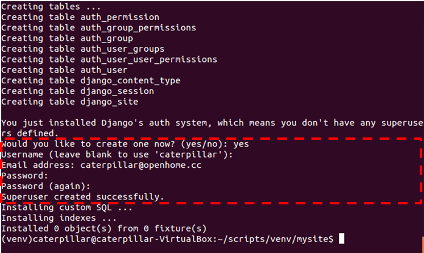

接下來鍵入指令 `python manage.py startapp polls` 建立一個簡單的 `poll` app，這是一個用來作問題投票用的簡單 app；然後編輯 polls/models.py 的內容如下：

```python
from django.db import models
 
class Poll(models.Model):
    question = models.CharField(max_length=200)
    pub_date = models.DateTimeField('date published')
 
    def was_published_recently(self):
        return self.pub_date >= timezone.now() - datetime.timedelta(days=1)
 
    def __unicode__(self):
        return self.question
 
class Choice(models.Model):
    poll = models.ForeignKey(Poll)
    choice_text = models.CharField(max_length=200)
    votes = models.IntegerField()
 
    def __unicode__(self):
        return self.choice_text
```
這建立了兩個資料模型 `Poll` 與 `Choice`，`Poll` 中有 `question` 與 `pub_date` 兩個欄位，代表想問題描述與發佈日期，`was_published_recently` 方法用來判斷，這個問題是不是最近一日內新發佈的，`__unicode__` 用來傳回 Poll 實例的字串說明。`Choice` 則用來記錄投票選項，`poll` 關聯至問題（`Choice` 實例），`choice_text` 是該問題的選項文字，`votes` 是投票數。

這個 app 剛建立，你必須讓目前專案知道，這要在 mysite/settings.py 中設定，找到其中的 `'INSTALLED_APPS'`，在最後加入 `'polls'`：

```python
INSTALLED_APPS = (
    'django.contrib.auth',
    'django.contrib.contenttypes',
    'django.contrib.sessions',
    'django.contrib.sites',
    'django.contrib.messages',
    'django.contrib.staticfiles',
    # Uncomment the next line to enable the admin:
    # 'django.contrib.admin',
    # Uncomment the next line to enable admin documentation:
    # 'django.contrib.admindocs',
    'polls'
)
```

接著你可以分別執行 `python manage.py sql polls` 預覽將執行的 SQL，以及 `python manage.py syncdb` 指令進行資料庫同步，執行時的參考畫面如下：

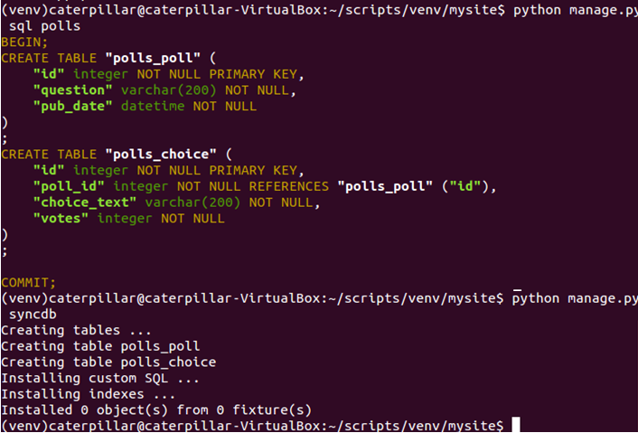

接著你可以鍵入 `python manage.py shell` 指令，這會設定 `DJANGO_SETTINGS_MODULE` 環境變數，讓你可以取用 Django 的 Python 模組，然後進入 Python 互動環境，你可以在當中體驗一些 API 的使用，這些 API 是在先前的幾個動作中已經產生的，例如來玩一下 `Poll` 實例建立想調查的問題：

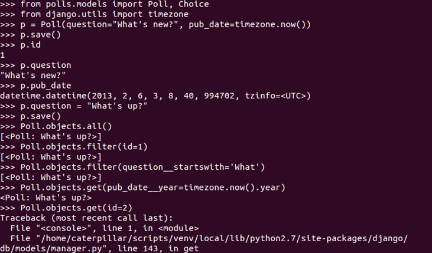

或者是建立 `Choice` 與 `Poll` 的一對一關係：

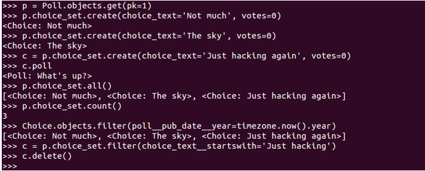

對 `Poll` 及 `Choice` 的操作，其實都會由 Django 進行一些物件關係對應（Object-Relational Mapping, ORM），也就是相關狀態，在某些操作時，都會同步至資料庫。

接下來，是該進行頁面設計了 …

## 撰寫 Django 中第一個 View

瞭解如何使用 Django 基本的 ORM 操作之後，現在該是來撰寫第一個 View 的時候了，我們直接從練習中來瞭解如何撰寫。

### 練習 11：撰寫第一個 View

開啟 polls/views.py，在當中撰寫如下的程式碼：

```python
from django.http import HttpResponse
 
def index(request):
    return HttpResponse("Hello, world. You're at the poll index.")
 
def detail(request, poll_id):
    return HttpResponse("You're looking at poll {id}.".format(id = poll_id))
 
def results(request, poll_id):
    return HttpResponse("You're looking at the results of poll {id}.".format(id = poll_id))
 
def vote(request, poll_id):
    return HttpResponse("You're voting on poll {id}.".format(id = poll_id))
```

這兒的四個函式，將對應至不同的 URL 請求，目前只是簡單的作些字串顯示。每個函式的第一個參數，實際上會是 `HttpRequest` 實例，封裝了關於請求的相關資料，有些 URL 請求會帶有 `poll_id` 請求參數，這可以在函式的第二個參數取得請求值。

每個 URL 請求該如何對應至函式，可以在 `polls` 目錄下建立一個 urls.py 檔案進行定義：

```python
from django.conf.urls import patterns, url
 
from polls import views
 
urlpatterns = patterns('',
    # ex: /polls/
    url(r'^$', views.index, name='index'),
    # ex: /polls/5/
    url(r'^(?P<poll_id>\d+)/$', views.detail, name='detail'),
    # ex: /polls/5/results/
    url(r'^(?P<poll_id>\d+)/results/$', views.results, name='results'),
    # ex: /polls/5/vote/
    url(r'^(?P<poll_id>\d+)/vote/$', views.vote, name='vote'),
)
```

`url` 的第一個參數接受規則表示式（Regular expression），用來定義 URL Pattern，第二個參數表示該對應至哪個函式，第三個參數用來定義這個 URL Pattern 的名稱，某些地方若要參考這個定義，可以透過名稱來指定參考。

如果你仔細看上頭的規則表示式定義，會發現並沒有定義 `polls` 前置名稱，實際上這是在 mysite 目錄中的 urls.py 定義。例如：

```python
from django.conf.urls import patterns, include, url
 
urlpatterns = patterns('',
    url(r'^polls/', include('polls.urls'))
)
```

這個 urls.py 定義了全名的 URL 對應，在上頭可以看到定義了 `polls` 前置名稱下，接下來的規則是包括在 `polls.urls`，也就是方才在 polls 目錄中定義的 urls.py 中。

完成以上定義之後，可以鍵入指令 `python manage.py runserver`，然後分別用瀏覽器請求不同網站，你應該會看到以下結果：

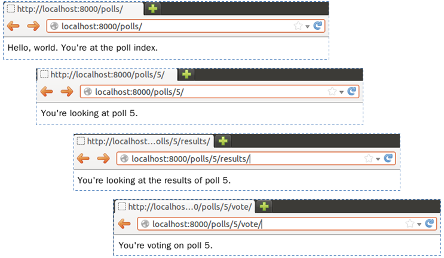

- Controller 還是 View？

如果你曾使用過其他的 Web MVC 框架，可能會對這個練習感到疑惑，為什麼處理請求的函式是定義在 views.py 這樣的檔案名稱之中？在其他框架中，你知道處理請求參數不都是 Controller 嗎？

就名稱上來說，哪個才是標準名稱，其實是有爭議的；不過**在 Django 之中，將特定 URL 對應的回呼函式認定為 View**，那麼 Django 中 Controller 是在哪邊？也許就是 Django 框架本身！

實際上，大部份 Web MVC 框架確實也都會有一些請求的前置處理，當請求到達實際的 Controller 時，對請求要進行的處理，通常就是（或最好）只剩下轉發請求給商務 Model，取得樣版（Template）引擎必要的資料 Model，然後再轉發給 View 進行呈現。

Django 或許只是在實作上更強制地彰顯了這點，或許可以這麼說，**Django 其實是個 MTV 框架，也就是 Model、Template、View 框架**。

> 有些人會將 Django 與 Rails 相比較，也可能會問，在 Rails 中有 `before_filter` 這類方法，可以作為 Controller 處理請求前的過濾器，那麼 Django 有嗎？嗯 … 因為 Django 本身 Controller 的功能是由框架本身負擔，也因此沒有 Rails 中 `before_`、`around_` 與 `after_ filter` 的概念，如果真的要在 views.py 中的函式被呼叫前，進行某些處理，直接手工寫個裝飾器（Decorator）函式並不會太困難，或者你也可以使用現成的一些通用裝飾器，你可以參考 [User authentication in Django](https://docs.djangoproject.com/en/dev/topics/auth/)。

- URLconf

Django 中呼叫哪個 view，是由 Python 的 URLconf（非正式名稱）模組來決定，這些模組是純 Python 撰寫，在 URL Pattern 與 Python 回呼函式（也就是你的 View）之間進行簡單的對應。

`url` 函式有兩個必要與一個建議指定的參數：

- `regex`：使用規則表示式定義的 URL Pattern。
- `view`：如果 Django 發現有符合的規則表示式時，應當呼叫的特定函式，該函式第一個參數是 `HttpRequest` 型態，第二個之後的引數會是經由規則表示式捕捉到的值。
- `name`：為 URL 定義的名稱，可作於 Django 樣版其他地方參考時使用。

如果你還不清楚規則表示式，以下作些簡單的說明，mysite/urls.py 中定義的部份，意義如下：

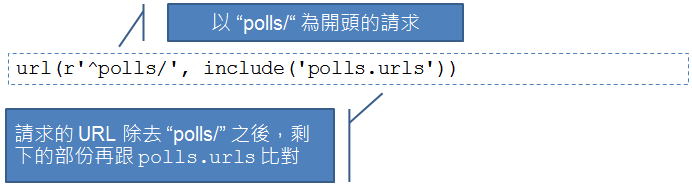

而 polls/urls.py 中定義的部份，意義如下：

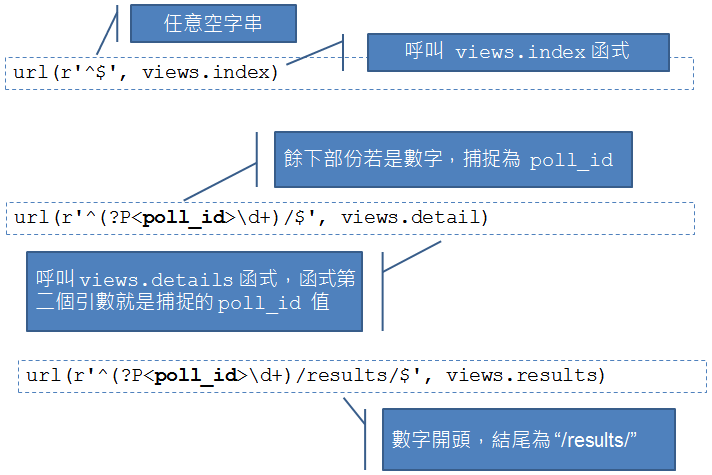

第四堂到這邊就先休息一下吧！第五堂我們還要繼續深入 Django，像是模版系統 …

## 參考資料

- 程式庫與框架
  - [InversionOfControl](http://martinfowler.com/bliki/InversionOfControl.html)

- Django 起步走
  - [Django at a glance](https://docs.djangoproject.com/en/1.5/intro/overview/)
  - [Django documentation](https://docs.djangoproject.com/en/1.5/)
  - [Django Quick install guide](https://docs.djangoproject.com/en/1.5/intro/install/)
  - [installing django 1.5(development version) in virtualenv](http://stackoverflow.com/questions/12339608/installing-django-1-5development-version-in-virtualenv)
  - [Writing your first Django app, part 1](https://docs.djangoproject.com/en/1.5/intro/tutorial01/)

- 撰寫第一個 View
  - [Writing your first Django app, part 3](https://docs.djangoproject.com/en/1.5/intro/tutorial03/)
  - [Django appears to be a MVC framework, but you call the Controller the “view”, and the View the “template”. How come you don’t use the standard names?](https://docs.djangoproject.com/en/dev/faq/general/#django-appears-to-be-a-mvc-framework-but-you-call-the-controller-the-view-and-the-view-the-template-how-come-you-don-t-use-the-standard-names)
  - [Using the Django authentication system](https://docs.djangoproject.com/en/1.5/topics/auth/default/)

----------
----------

# Python Tutorial 第五堂

在上一堂課結束前，我們在 polls/views.py 中撰寫回應結果，雖然概念上 polls/views.py 是屬於 View 的一部份，不過實際的畫面組織不建議撰寫在這當中，想想看，如果你想要 HTML 輸出，那麼直接在 polls/views.py 中撰寫 HTML 輸出，程式碼與 HTML 糾結在一起，會是什麼樣的混亂結果。

## 使用模版系統

概念上 polls/views.py 是屬於 View 的一部份，不過建議當中只使用 Python 程式碼來準備畫面中動態的資料部份，但不包括頁面組織以及相關的呈現邏輯。你可以使用 Django 的模版系統，將頁面組織以及相關的呈現邏輯，從 Python 程式碼中抽離出來，你可以如下圖中，使用模版標籤的元素來控制呈現邏輯，使用 dot 查找語法來取得文脈變數（Context variable）：


### 練習 12：撰寫模版

在你的 polls 目錄中建立一個 templates 目錄，Django 會在這個目錄中尋找模版，在 templates 目錄中建立另一個名為 polls 的目錄，並在其中建立一個名為 index.html 的檔案。

也就是說，現在你建立了一個模版檔案 polls/templates/polls/index.html，接著將以下的程式碼放入模版之中：

```python

    <ul>
    
        <li><a href="/polls/{{ poll.id }}/">{{ poll.question }}</a></li>
    
    </ul>

    <p>No polls are available.</p>

```

接著再建立一個名為 detail.html 的檔案，並撰寫以下的程式碼：

```python
<h1>{{ poll.question }}</h1>
<ul>

    <li>{{ choice.choice_text }}</li>

</ul>
```

開啟 polls/views.py，並修改 `index` 與 `detail` 函式為以下，記得 `from import` 的部份也要一致：

```python
from django.shortcuts import render
 
from polls.models import Poll
from django.http import Http404
 
def index(request):
    latest_poll_list = Poll.objects.all().order_by('-pub_date')[:5]
    context = {'latest_poll_list': latest_poll_list}
    return render(request, 'polls/index.html', context) 
 
def detail(request, poll_id):
    try:
        poll = Poll.objects.get(pk=poll_id)
    except Poll.DoesNotExist:
        raise Http404 # 產生 404 回應
    return render(request, 'polls/detail.html', {'poll': poll})
```

其中 `'latest_poll_list'` 用來設定文脈變數名稱，而 `render` 函式第二個引數 `'polls/index.html'` 用來設定要呈現的模版檔案名稱。

接著使用 `python manage.py shell` 啟動 Python 互動環境，然後如下建立一個新的調查問題以及兩個選項：

```python
from polls.models import Poll, Choice
from django.utils import timezone
p = Poll(question="What's up?", pub_date=timezone.now())
p.save()
p.choice_set.create(choice_text='Not much', votes=0)
p.choice_set.create(choice_text='The sky', votes=0)
```

執行 `python manage.py runserver` 之後，你應該可以在使用瀏覽器請求相關網址時，看到以下畫面：


## 模版系統的一些細節

在 〈練習 12〉 當中使用的 `render` 函式，實際上封裝了模版檔案載入、`Context` 物件建立、建立 `HttpResponse` 物件等細節的簡便函式，如果不使用 `render` 函式，那麼 `index` 函式就必須寫為：

```python
from django.http import HttpResponse
from django.template import Context, loader
from polls.models import Poll
 
def index(request):
    latest_poll_list = Poll.objects.order_by('-pub_date')[:5]
    template = loader.get_template('polls/index.html')
    context = Context({
        'latest_poll_list': latest_poll_list,
    })
    return HttpResponse(template.render(context))
```

你可以看到，Django 最後需要的是 `index` 傳回一個 `HttpResponse` 物件，而物件建構時，必須給它一個回應用的字串，只不過現在是透過模版系統來產生這個字串。

實際上，這個練習中的 `detail` 函式中，使用 `Poll` 指定主鍵來查詢物件，並在主鍵沒有對應物件時 `raise Http404` 的片段：

```python
from django.http import Http404
# ...
def detail(request, poll_id):
    try:
        poll = Poll.objects.get(pk=poll_id)
    except Poll.DoesNotExist:
        raise Http404
    return render(request, 'polls/detail.html', {'poll': poll})
```

也可以用一個簡便的函式 `get_object_or_404` 修改為以下更簡潔的函式：

```python
from django.shortcuts import render, get_object_or_404
# ...
def detail(request, poll_id):
    poll = get_object_or_404(Poll, pk=poll_id)
    return render(request, 'polls/detail.html', {'poll': poll})
```

`get_object_or_404` 的第一個函式接受類別名稱，如果指定 `pk` 參數，那麼就會自動呼叫指定類別上的 `objects` 之 `get` 方法來查詢。

回頭看一下模版檔案 index.html 中超鏈結部份的內容：

```python
...
    
        <li><a href="/polls/{{ poll.id }}/">{{ poll.question }}</a></li>
    
...
```

超鏈結部份的網址是寫死的，如果像這樣的鏈結資訊有很多寫死在不同的模版檔案中，將來如果不想使用 polls 這個目錄，那就得記得修改每個模版檔案中的鏈結，還記得在 `polls.urls` 模組中撰寫了每個 `url` 函式的 `name` 資訊嗎？


你可以在模版檔案中，使用 `` 模版標籤取得 `name` 設定的名稱，例如：


這樣就會對應至 `polls.urls` 模組中，`name` 設定為 `'detail'` 的 `url` 資訊，自動產生鏈結用的字串，將來如果要改變鏈結，就只需要在 `polls.urls` 模組中修改，不用逐一修改每個模版檔案。

## URL `namespace` 與簡易表單

目前你的 `polls.urls` 模組中，每個 `url` 都設定了 `name`：


有沒有想過，如果在不同 App 的 `urls` 模組中，也有重複的 `name` 設定值該怎麼辦？實際上，你可以為每個 App 的 `urls` 模組設定不同的名稱空間（Namespace），來避免名稱衝突的問題發生，在接下來的練習 13 中，也要來看看如何建立一個簡易表單。

### 練習 13：設定 URL `namespace` 與簡易表單

在目前的 mysite/urls.py 檔案中，在 `include` 函式上增加 `namespace='polls'`：


接下來，你就可以在模版中使用這個名稱空間設定，例如，修改 polls/index.html 模版：


接著要來建立一個簡易表單了，修改 polls/detail.html，如下包括 HTML 的 `<form>` 標籤內容：


在 polls/views.py 中增加以下內容與修改 `results` 及 `vote`，讓 `results` 可以根據請求的 `poll_id` 與指定的模版檔案繪製畫面，而 `results` 用以取得 `poll_id` 更新選項結果：


當然，我們必須建立 polls/results.html 模版檔案：


接著你可以試著連結網站，在上頭作些投票，你應該可以看到以下結果：


## 簡介 CSRF

在 〈練習 13〉 中看到了個 ``，這是什麼？CSRF 全名 Cross-Site Request Forgery，中文常翻為跨站請求攻擊或跨站偽造請求，這是利用 Web 應用程式在設計 HTTP 請求時，因為考量不周全造成的漏洞，從而進行攻擊的手法，通常是在 Web 應用程式站外的其他頁面中，包括惡意程式碼或鏈結，當使用者已通過驗證且會話（Session）未過期時，瀏覽該頁面或點選該惡意鏈結，就會造成攻擊成功的可能性。

一個 CSRF 攻擊的情境範例會像是 ...

1. Bob 登入了 www.webapp.com ，並且會話尚未過期。
2. Bob 瀏覽了另一個頁面，這個頁面中包括了惡意駭客置入的 ``，然後 Bob 的某個專案就莫名奇妙被刪除了。
3. Bob 瀏覽的頁面是不是跟 www.webapp.com 同一個網站並不重要，也許是在另一個論譠、Blog 或特意發給 Bob 的郵件中。

瀏覽器遇到 `` 時，就會自動以 GET 請求 `src` 指定的網址，就這個情境來說，攻擊要能成立的前題，是 /project/1/destroy 這樣的請求就能刪除專案，這很顯然是 URL 設計時的不良，加上應用程式沒有在重大操作之前，進一步確認使用者身份與意圖而導致。

對於 HTTP 請求，有些人會有 GET 不安全，而 POST 比較安全的錯誤觀念，乍看這個例子好像是如此，實際上，也可以透過 POST 來發動類似的請求。例如：

```html
<a href="http://www.harmless.com/" onclick="
  var f = document.createElement('form');
  f.style.display = 'none';
  this.parentNode.appendChild(f);
  f.method = 'POST';
  f.action = 'http://www.example.com/account/destroy';
  f.submit();
  return false;">好康在這裡</a>
```

就算不點選，只要滑鼠略過圖也可以 ...

```html

```

就算沒有任何滑鼠操作，現在只要利用一些 JavaScript 寫些 Ajax 請求，都有可能讓這類攻擊發生 ...

先前談過，CSRF 是利用 Web 應用程式在設計 HTTP 請求時，因為考量不周全造成的漏洞，因此，防範方式就是認真思考 HTTP 請求方法之使用。單就 `<form>` 的 `method` 允許設置的 GET 與 POST 來說，至少要想一下：

- GET 應用於**等冪（Idempotent）**操作，相同請求重複多次都必須有相同結果，就 GET 而言，語義上也是「取得」資訊，因此 GET 請求不建議用於改變應用程式狀態。
- POST 應用於**非等冪**操作，同樣請求重複多次，可能會產生不同結果，也就是會改變應用程式狀態。

（實際上要考量的不只有等幂性，還有請求方法是否安全（Safe），進一步地，在 REST 架構設計下，還有更多的 HTTP 請求方法（像是 PUT、DELETE 等）考量，可參考 [重新認識HTTP請求方法](http://openhome.cc/Gossip/Programmer/HttpMethod.html)。）

如果 GET 確實地應用於等冪操作，對於非 GET 請求，通常會用個安全代碼，在 Django 中，這可由 `` 來產生：


當你瀏覽表單時，`` 會產生隱藏欄位，當中包括了一組安全代碼，例如：


Django 應用程式接受請求時，必須同時在請求中找到這組安全代碼，從而確認請求是來自於同一站上的表單。

> 這個例子並不單只是如何防範 CSRF，主要想表達的是，安全其實是現代設計應用程式時應主動納入的考量，現在有不少框架也將安全納為特色之一，讓開發者不用煩惱安全防護實作時的枝微末節。

## 關於測試 

對於靜態定型語言（Statically-typing language），因為變數有型態資訊，因而編譯器等工具，可以在程式運行之前檢查出許多型態不正確的資訊。

Python 是動態定型語言（Dynamically-typing language），也就是說，在 Python 中變數沒有型態，只是用來作為參考實際物件的一根柄（Handle），如果有型態錯誤上的操作，基本上會是在執行時期運行至該段程式碼時，才會產生錯誤訊息，因此對於 Python 來說，檢查出型態不正確的任務，必須開發者本身來承擔，為程式設計測試程式，會是個不錯的方式之一。

（對於靜態定型語言，雖然有編譯器等工具，協助開發者於程式運行之前檢查型態錯誤問題，然而，設計優良測試程式檢測執行時期功能是否符合預期亦非常重要；對於動態語言，現在也有一些型態註解方案，可提供分析工具於程式運行前檢查型態資訊，像是 Python 的 [PEP-3170](http://legacy.python.org/dev/peps/pep-3107/) 提出的 Function annotation。）

在 Python 的世界中，當然不乏撰寫測試的相關工具，像是 …

- `assert` 陳述
  
    在程式中安插除錯用的斷言（Assertion）檢查時很方便的一個方式。

- `doctest` 模組
  
    在程式碼中找尋類似 Python 互動環境的文字片段，執行並驗證程式是否如預期方式執行。

- `unittest` 模組

    有時稱為 "PyUnit"，是 [JUnit](http://junit.org/) 的 Python 語言實現。

- 第三方測試工具
  - [nose](http://nose.readthedocs.org/en/latest/)
  - [pytest](http://pytest.org)

這一篇文章將會先介紹一下 `assert` 與 `doctest`，不過在繼續之前，先來談一下每個模組中都會有的 **`__name__`** 全域變數，當你執行直接某個 Python 模組時，例如：

    python fibo.py <arguments>

模組中的程式碼會像你執行 `import` 時般運行，不過 `__name__` 這個變數會被設定為 `'__main__'` 這個字串名稱，因此，如果想要為這個模組撰寫一個簡單的自我測試，可以如以下方式撰寫：

    if __name__ == "__main__":
        測試的程式碼

當你直接執行某個模組時，`if` 條件才會成立，測試的程式碼才會執行，而 `import` 該模組時，因為 `__name__` 會是模組名稱，因此就不會在 `import` 執行測試的程式碼。

## 使用 `assert` 斷言

要在程式中安插斷言，使用 `assert` 很方便，其語法如下：

    assert_stmt ::=  "assert" expression ["," expression]
 
使用 `assert expression` 的話，相當於以下的程式片段：

```python
if __debug__:
    if not expression: raise AssertionError
```

如果有兩個 `expression`，例如 `assert expression1, expression2`，相當於以下的程式片段：

```python
if __debug__:
    if not expression1: raise AssertionError(expression2)
```

也就是說，第二個 `expression` 的結果，會被當作 `AssertionError` 的錯誤資訊結果。

`__debug__` 是個內建變數，一般情況下會是 `True`，如果執行時需要最佳化時（在執行時加上 **`-O`** 引數）則會是 `False`。例如以下是互動環境中的一些例子：

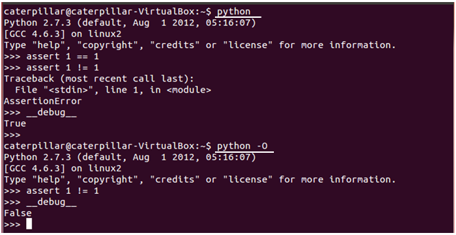

那麼何時該使用斷言呢？...一般有幾個建議：

- 前置條件（通常在私有函式之中）

    斷言客戶端呼叫函式前，已經準備好某些條件。
 
- 後置條件

    驗證客戶端呼叫函式後，具有函式承諾有結果。

- 類別不變量（Class invariant）

    驗證物件某個時間點下的狀態。

- 內部不變量（Internal invariant）

    使用斷言取代註解。    

- 流程不變量（Control-flow invariant）

    斷言程式流程中絕不會執行到的程式碼部份。

前置條件斷言的例子如下：

```python
def __set_refresh_Interval(interval):
    if interval > 0 and interval <= 1000 / MAX_REFRESH_RATE:
        raise ValueError('Illegal interval: ' + interval)
    # 接續函式中的程式流程
```

程式中的 `if` 檢查進行了防禦式程式設計（Defensive programming
），如果想要用 `assert` 取代，可以如下：

```python
def __set_refresh_Interval(rate):
    (assert interval > 0 and interval <= 1000 / MAX_REFRESH_RATE, 
            'Illegal interval: ' + interval)
    # 接續函式中的程式流程
```

> 防禦式程式設計有些不好的名聲，不過並非做了防禦式程式設計就不好，可以參考 [避免隱藏錯誤的防禦性設計](http://openhome.cc/Gossip/Programmer/DefensiveProgramming.html)。

一個內部不變量的例子則是如下：

```python
if balance >= 10000:
    ...
elif 10000 > balance >= 100:
    ...
else: # balance 一定是少於 100 的情況
    ...
```

如果要在 `else` 的 `balance` 不是少於 100 的情況下拋出 `AssertError`，以實現速錯（Fail fast）概念，而不是只使用註解來提醒開發者，則可以改為以下：

```python
if balance >= 10000:
    ...
elif 10000 > balance >= 100:
    ...
else:
    assert balance < 100, balance
    ...
```

另一個情況是：

```python
if suit == Suit.CLUBS:
    ...
elif suit == Suit.DIAMONDS:
    ...
elif suit == Suit.HEARTS:
    ...
elif suit == Suit.SPADES:
    ...
```

如果列舉檢查只會有以上四個條件，也可以運用斷言來實現速錯：

```python
if suit == Suit.CLUBS:
    ...
elif suit == Suit.DIAMONDS:
    ...
elif suit == Suit.HEARTS:
    ...
elif suit == Suit.SPADES:
    ...
else:
    assert False, suit
```

程式碼中有些一定不會執行到的流程區段，可以使用斷言來確保這些區段被執行時拋出錯誤。例如：

```python
def foo(list):
    for ele in list:
        if ...:
            return
    # 這邊應該永遠不會被執行到
```

可以改為：

```python
def foo(list):
    for ele in list:
        if ...:
            return
    assert False
```

## 使用 `doctest` 測試

`doctest` 一方面是測試程式碼，一方面也是用來確認 docStrings 的內容沒有過期，基本上它驗證互動式的範例來執行 [回歸測試（Regression testing）](http://zh.wikipedia.org/wiki/%E5%9B%9E%E5%BD%92%E6%B5%8B%E8%AF%95)，開發者只要為套件撰寫輸入輸出式的教學範例就可以了，這有點文學測試（Literate testing） 或可執行文件（executable documentation）的味道。

舉例來說，你也許為 util.py 中的 `sorted` 撰寫了以下的 docstrings：

```python
def sorted(xs, compare = ascending):
    '''
    sorted(xs) -> new sorted list from xs' item in ascending order.
    sorted(xs, func) -> new sorted list. func should return a negative integer, 
                        zero, or a positive integer as the first argument is 
                        less than, equal to, or greater than the second.

     >>> sorted([2, 1, 3, 6, 5])
    [1, 2, 3, 5, 6]
    >>> sorted([2, 1, 3, 6, 5], ascending)
    [1, 2, 3, 5, 6]
    >>> sorted([2, 1, 3, 6, 5], descending)
    [6, 5, 3, 2, 1]
    >>> sorted([2, 1, 3, 6, 5], lambda a, b: a - b)
    [1, 2, 3, 5, 6]
    >>> sorted([2, 1, 3, 6, 5], lambda a, b: b - a)
    [6, 5, 3, 2, 1]
    '''

    return [] if not xs else __select(xs, compare)
```

在同一個模組中，撰寫了以下的程式片段：

```python
if __name__ == '__main__':
    import doctest
    doctest.testmod()
```

那麼直接執行模組時，就會執行測試，加上 `-v` 會顯示細節：

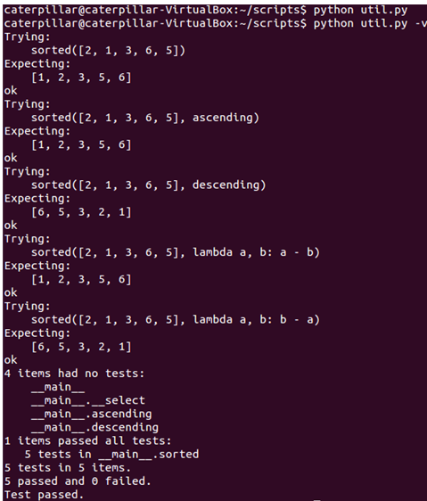

你也可以將這類文件寫在文字檔案中，例如一個 util_test.txt：

```python
The ``util`` module
======================
    
Using ``sorted``
-------------------
    
>>> from util import *
>>> sorted([2, 1, 3, 6, 5])
[1, 2, 3, 5, 6]
>>> sorted([2, 1, 3, 6, 5], ascending)
[1, 2, 3, 5, 6]
>>> sorted([2, 1, 3, 6, 5], descending)
[6, 5, 3, 2, 1]
>>> sorted([2, 1, 3, 6, 5], lambda a, b: a - b)
[1, 2, 3, 5, 6]
>>> sorted([2, 1, 3, 6, 5], lambda a, b: b - a)
[6, 5, 3, 2, 1]
```

而 util.py 中改寫為以下，就可以從文字檔案中讀取內容並執行測試：

```python
if __name__ == '__main__':
    import doctest
    doctest.testfile(“util_test.txt")
```

你也可以直接執行 `doctest` 模組來載入測試用的文字檔案以執行測試，例如：


### 練習 14：使用 `doctest`

請開啟 Lab 中 exercises/exercise14 的 util.py，將其中的兩行 `print` 陳述用以下取代：

```python
if __name__ == '__main__':
    import doctest
    doctest.testmod()
```

然而在 `sorted` 函式中撰寫上頭看過的 docstrings，完成後執行以下指令，看看會發生什麼事：

    python util.py
    python util.py -v

接著如上頭編輯 util_test.txt，完成後如下執行指令，看看會發生什麼事：

    python -m doctest util_test.txt
    python -m doctest –v util_test.txt

## 參考資料

- 使用模版系統
  - [Writing your first Django app, part 4](https://docs.djangoproject.com/en/1.5/intro/tutorial04/) 
  - [The Django template language](https://docs.djangoproject.com/en/1.5/topics/templates/) 

- 簡介 CSRF
  - [Cross-Site Request Forgery (CSRF)](http://guides.rubyonrails.org/security.html#cross-site-request-forgery-csrf) 
  - [重新認識HTTP請求方法](http://openhome.cc/Gossip/Programmer/HttpMethod.html) 

- 測試
  - [Modules](http://docs.python.org/2/tutorial/modules.html) 
  - [The assert statement](http://docs.python.org/2/reference/simple_stmts.html#the-assert-statement) 
  - [__debug__](http://docs.python.org/2/library/constants.html#__debug__)   
  - [doctest — Test interactive Python examples](http://docs.python.org/2/library/doctest.html)

----------
----------

# Python Tutorial 第六堂

Python Tutorial 的第六堂課要接續上一堂結束前談到的測試，來看看 `unittest` 模組，接著看看簡單的效能評測（Profile）工具，像是 `timeit`、`cProfile` 與 `pstats` 等。

## 使用 `unittest` 單元測試

`unittest` 有時亦稱為 "PyUnit"，是 [JUnit](http://junit.org/) 的 Python 語言實現，JUnit是個單元測試（Unit test）框架，單元測試指的是測試一個工作單元（a unit of work）的行為。舉例來說，對於建築橋墩而言，一個螺絲釘、一根鋼筋、一條鋼索甚至一公斤的水泥等，都可謂是一個工作單元，驗證這些工作單元行為或功能 （硬度、張力等）是否符合預期，方可確保最後橋墩安全無虞。

測試一個單元，基本上要與其它的單元獨立，否則你會在同時測試兩個單元的正確性，或是兩個單元之間的合作行為。就軟體測試而言，單元測試通常指的是測試某個函式（或方法），你給予該函式某些輸入，預期該函式會產生某種輸出，例如傳回預期的值、產生預期的檔案、新增預期的資料等。

`unittest` 模組主要包括四個部份：

- 測試案例（Test case）
  
    測試的最小單元。

- 測試設備（Test fixture）

    執行一或多個測試前必要的預備資源，以及相關的清除資源動作。

-  測試套件（Test suite）

    一組測試案例、測試套件或者是兩者的組合。

- 測試執行器（Test runner）

    負責執行測試並提供測試結果的元件。

來分別看看這幾個部份的說明：

- 測試案例

對於測試案例的撰寫，`unittest` 模組提供了一個基礎類別 `TestCase`，你可以繼承它來建立新的測試案例。例如：

```python
import unittest
import calculator

class CalculatorTestCase(unittest.TestCase):
    def setUp(self):
        self.args = (3, 2)

    def tearDown(self):
        self.args = None

    def test_plus(self):
        expected = 5;
        result = calculator.plus(*self.args);
        self.assertEquals(expected, result);

    def test_minus(self):
        expected = 1;
        result = calculator.minus(*self.args);
        self.assertEquals(expected, result);
```

每個測試必須定義在一個 **test** 名稱為開頭的方法中，一個 `TestCase` 的子類別，通常用來為某個類別或模組的單元方法或函式定義測試。

- 測試設備

許多單元測試經常藬用相同的測試設備，你可以在 `TestCase` 的子類別中定義 `setUp` 與 `tearDown` 方法，測試執行器會在每個測試運行之前執行 `setUp` 方法，每個測試運行之後執行 `tearDown` 方法。

一個實際情境可以像是在 `setUp` 方法中建立新表格並在表格中新增資料，執行測試之後，在 `tearDown` 方法中刪除表格。

- 測試套件

根據測試的需求不同，你可能會想要將不同的測試組合在一起，例如，`CalculatorTestCase` 中可能有數個 `test_xxx` 方法，而你只想將 `test_plus` 與 `test_minus` 組裝為一個測試套件的話，可以如下：

```python
suite = unittest.TestSuite()
suite.addTest(CalculatorTestCase('test_plus'))
suite.addTest(CalculatorTestCase('test_minus'))
```

或者是使用一個 `list` 來定義要組裝的 `test_xxx` 方法清單：

```python
tests = ['test_plus', 'test_minus']
suite = unittest.TestSuite(map(CalculatorTestCase, tests))
```

如果想要自動載入某個 `TestCase` 子類別中所有 `test_xxx` 方法，可以如下：

```python
unittest.TestLoader().loadTestsFromTestCase(CalculatorTestCase)
```

你可以任意組合測試，例如，將某個測試套件與某個 `TestCase` 中的 `test_xxx` 方法組合為另一個測試套件：

```python
suite2 = unittest.TestSuite()
suite2.addTest(suite)
suite2.addTest(OtherTestCase('test_orz'))
```

也可以將許多測試套件再全部組合為另一個測試套件：

```python
suite1 = module1.TheTestSuite()
suite2 = module2.TheTestSuite()
alltests = unittest.TestSuite([suite1, suite2])
```

- 測試執行器

你可以在程式碼中直接使用 `TextTestRunner`，例如：

```python
suite = (unittest.TestLoader()
                 .loadTestsFromTestCase(CalculatorTestCase))
unittest.TextTestRunner(verbosity=2).run(suite)
```

或者是透過 `unittest.main` 函式來執行：

```python
unittest.main(verbosity=2)
```

一個執行的畫面如下：

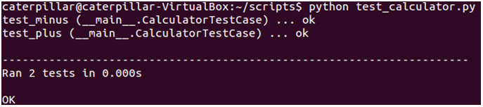

如果不想透過程式碼定義，也可以在命令列中使用 `unittest` 模組來運行模組、類別或甚至個別的測試方法：

```python
python -m unittest test_module1 test_module2
python -m unittest test_module.TestClass
python -m unittest test_module.TestClass.test_method
```

如果想得到更詳細的測試資訊，可以加上 `-v` 引數：

```python
python -m unittest -v test_module
```

想得知 `unittest` 所有可用的引數，可以使用以下指令：

```python
python -m unittest -h
```

#### 練習 15：重構與單元測試

重構是改造既有程式的過程，對於重構的概念與技巧，可以參考 《Refactoring - Improving the Design of Existing Code》 這本書，中文翻譯為 《重構 — 改善既有程式的設計》，[侯捷](http://jjhou.boolan.com/) 老師將 [中文版翻譯的前六章開放下載](http://jjhou.boolan.com/jjtbooks-refactoring.htm)，雖然程式碼示範是使用 Java，不過就重構過程的學習來說，非常值得閱讀：

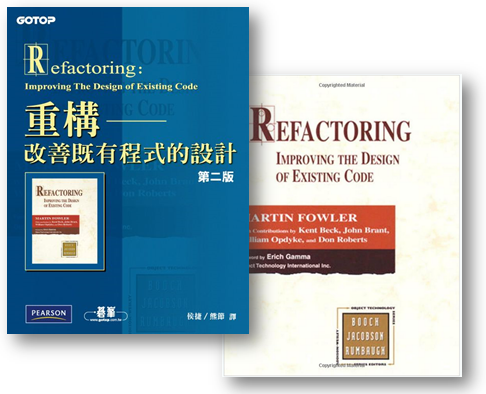

接下來的練習，就是利用該書一開始的影片出租店範例，不過我將之改成了 Python 版本，在 Lab 檔案的 exercises/exercise15 中，有個 dvdlib.py，就相當於該書第一章一開始的範例程式。

我們要重構的是 `Customer` 類別中的 `statement` 方法，流程則是彷造該書 〈1.3 分解並重構 `statement`〉 的內容，為了確保重構過程中，不會破壞既有程式的功能，我們要使用 `unittest` 模組來進行單元測試。

重構之前的類別圖是這樣的：

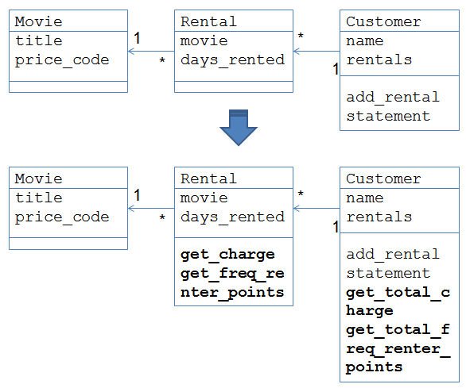

重構之後的類別圖則是：

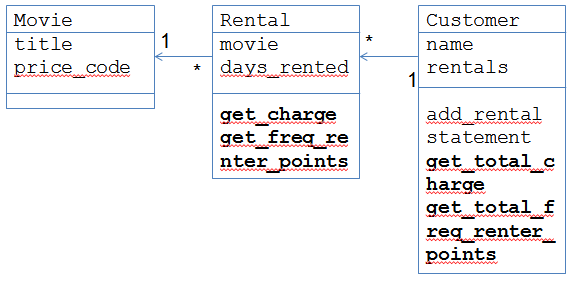

別忘了，你得在每次的重構之前，先寫好測試，重構後執行測試，確保你沒有破壞了什麼，練習的過程中你會發現，因為有測試確保了功能不破壞，你會更有信心進行重構。

> 當然，配合版本控制系統的話，會是更好的方式！

## 關於效能評測

效能評測是我們要談的最後一個主題了，這是個很大的議題，嗯 ... 應該說，這六堂課每一個主題，都可以是個很大的議題，雖然課程接近尾聲了，但別忘了，這只是個簡短的生態之旅！

拉回來效能評測這個主題，就 Python 內建模組來說，我們要介紹的有：

- `timeit`

    用來量測一個小程式片段的執行時間。

- `cProfile`

    用來收集程式執行時的一些時間數據，提供各種統計數據，對大多數的使用者來說是不錯的工具，這是用 C 撰寫的擴充模組。

- `profile`

    介面上彷造了 `cProfile`，不過是用純 Python 來實現的模組，因此有較高的互通性；`cProfile` 在評測時有較低的額外成本，不過並不是所有系統上都有提供。

## `timeit` 模組

在介紹 `timeit` 之前，來看一個情境，你會怎麼撰寫程式來產生以下執行結果呢？

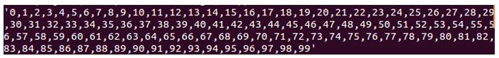

以下的程式，因為使用了 `+` 進行串接，所以會比較慢嗎？

```python
all = ''
for str in strs: # strs 是 ['0', '1', '2', '3', ..., '98']
    all = all + str + ',' 
all = all + '99'
```

也許你聽過一種說法，對 `list` 使用 `join` 會比較快？

```python
','.join(strs) # strs 是 ['0', '1', '2', '3', ..., '99']
```

傳說拔到獅子的鬃毛，程式就會自己生出來嘞！別再相信沒有根據的說法了，試試 `timeit`！

來看看喔！如果有個 `s` 字串是這樣定義的：

```python
s = '''
all = ''
for str in strs:
    all = all + str + ','
all = all + '99'
'''
```

那麼，以下的 `timeit` 測試，似乎證明了 `+` 串接字串一定比較慢，而使用 `join` 一定比較快：

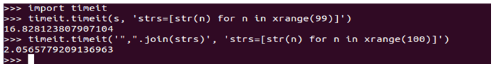

`timeit` 的第一個參數接受一個用字串表示的程式片段，第二個參數是準備測試用的材料，也是用字串表示的程式片段，`timeit` 在材料準備好之後，就會運行第一個參數指定的程式片段並量測時間，單位是秒！嗯！就結果看來，`join` 勝出！

不過，以下卻是相反的結果：

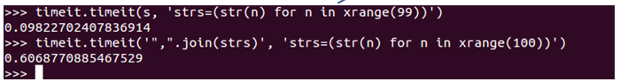

差別在哪呢？在準備 `strs` 時，兩個都將 `[]` 改成了 `()` 罷了！這邊的重點並不在探討哪個快慢，只是想表示兩個觀念：

- 效能是程式結合後的整體考量，不是單一概念
- 效能不是用猜的，要有實際的評測作為依據

`timeit` 預設是執行程式片段 1,000,000 次，然後取平均時間，以下是幾個直接透過 API 運行的範例：

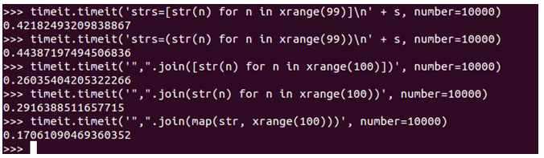

也可以透過命令列的指令來執行評測：

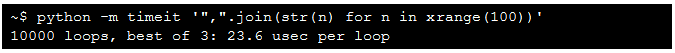 

一個更實際的例子，可以在 Lab 檔案的 demos/timeit 中找到，這是一個評測排序的範例：

```python
import timeit

repeats = 1000

for f in ('selectionSort', 'insertionSort', 'bubbleSort'):
    t = timeit.Timer('{0}([10, 9, 1, 2, 5, 3, 8, 7])'.format(f),
        'from sorting import selectionSort, insertionSort, bubbleSort')
    sec = t.timeit(repeats) / repeats
    print '{f}\t{sec:.6f} sec'.format(**locals())
```

以下是執行的結果：

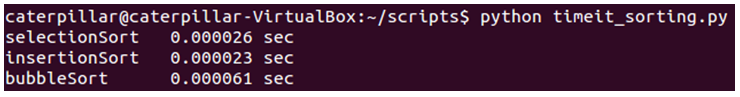 

## cProfile（profile）

`cProfile` 提供有關程式運行時更多的統計資訊，你要有一個主要的進入點。例如：

```python
import cProfile
import sorting
import random

l = range(500)
random.shuffle(l)
cProfile.run('sorting.selectionSort(l)')
``` 

以下是個執行後的統計資訊：

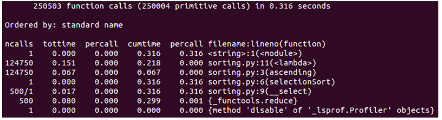 

這當中有一些欄位需要解釋一下：

- ncalls
    
    "number of calls" 的縮寫，也就是對特定函式的呼叫次數。

- tottime

    "total time" 的縮寫，花費在函式上的執行時間（不包括子函數呼叫的時間）。

- percall

    tottime / ncalls 的結果。

- cumtime

    "cumulative time" 的縮寫，花費在函式與所有子函式的時間（從呼叫至離開）。

- percall

    cumtime / ncalls 的結果。

- filename:lineno(function)

    提供程式碼執行時的位置資訊。

## 使用 `pstats`

你可以使用 `pstats` 對 `cProfile` 的結果，進行各種運算與排序，可以先將 `cProfile` 收集的結果，儲存為一個檔案：

```python
cProfile.run('sorting.selectionSort(l)', 'select_stats')
```

然後，可以如下使用 `pstats` 載入檔案，並進行排序等運算：

```python
import pstats
p = pstats.Stats('select_stats')
p.strip_dirs().sort_stats('name').print_stats()
p.sort_stats('cumulative').print_stats(10)
p.sort_stats('time').print_stats(10)
```

一個執行結果如下：

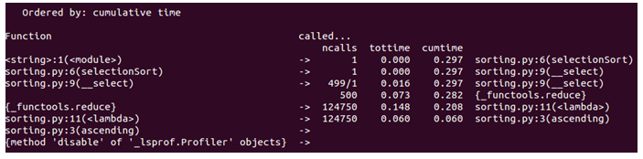 
    

你可以直接使用 `cProfile` 模組將另一個模組載入執行，例如：

    python -m cProfile myscript.py

或者是：

    cProfile.py [-o output_file] [-s sort_order]

> 如果想使用圖形化方式，來看看評測結果，可以試試 [RunSnakeRun](http://www.vrplumber.com/programming/runsnakerun/ )。

## 關於 PyCon Taiwan

終於，本課程到了尾聲了 ... 最後我們來認識一下 PyCon Taiwan！

PyCon 是全球 Python 同好自發籌辦的年會活動，從 2012 年起，台灣也有自己的 Python 年會。PyCon Taiwan 聚集各領域應用 Python 的組織與個人，分享最新的技術發展，交流 Python 禪學的文化體驗。台灣 Python 年會期許成為創造價值、提昇技術的園地。

這門課程實際施行於 PyCon Taiwan 2013，而寫完中文版整理時，正值 PyCon APAC 2014 籌辦之時，PyCon APAC 第一到第三屆是在新加坡舉辦，第四屆是在日本。

第五屆是 PyCon APAC 2014，選定在台灣舉辦，預計時間是 2014 年 5 月 17、18 兩日，地點在台北，相關資訊可以在 [PyCon APAC 2014](https://tw.pycon.org/2014apac/zh/) 網站查詢。

過往兩屆的 PyCon Taiwan 資訊，則可以在以下取得：

- [PyCon Taiwan 2012](http://tw.pycon.org/2012/program/)
- [PyCon Taiwan 2013](http://tw.pycon.org/2013/en/program/)

## 參考資料

- 測試
  - [unittest — Unit testing framework](http://docs.python.org/2/library/unittest.html) 
  - [Testing Your Code](https://python-guide.readthedocs.org/en/latest/writing/tests/) 

- 評測
  - [timeit — Measure execution time of small code snippets](http://docs.python.org/2/library/timeit.html) 
  - [The Python Profilers](http://docs.python.org/2/library/profile.html) 
  - [RunSnakeRun](http://www.vrplumber.com/programming/runsnakerun/) 

- PyCon Taiwan
  - [PyCon Taiwan 2012](http://tw.pycon.org/2012/program/)
  - [PyCon Taiwan 2013](http://tw.pycon.org/2013/en/program/)
  - [PyCon APAC 2014](https://tw.pycon.org/2014apac/zh/)  


